## Lecture 1: Points, Lines, and Configurations

### Euclid's Elements
Two Thousand Years ago, a Greek mathematician named Euclid wrote a book called "Elements" that laid the foundation for geometry as we know it today. It contains thirteen books covering various aspects of mathematics, including plane geometry, number theory, and solid geometry. Euclid's systematic approach and logical deductions have influenced the way we study mathematics for centuries.

It does not only contain geometry topics on triangles, circles, and polygons, but also includes the irrationality of the square root of 2, the infinitude of prime numbers and the Euclidean algorithm for finding the greatest common divisor of two numbers.

### Points and Lines

Geometry is all about constructions and let us start with the basic definitions from Elements, Book I.

```
DEFINITIONS.

I. A point is that which has no parts.

II. A line is length without breadth.
```

Translating these into more familiar terms, we can say that a point represents a precise location in space, while a line is a one-dimensional figure without thickness that extends infinitely in both directions.

### Basic constructions
For the first chapter, the only allowable constructions are:

* You can draw points anywhere.
* You can draw a line using a ruler and extend it indefinitely in both directions.
* You can draw a line between any two points.
* You can mark the intersection of two lines as a point.


**Two points gives a line but two lines may not give a point**! For example, two parallel lines do not intersect.


### Basic construction examples
**Example 1** Given two solid lines that intersect, we can extend one line and mark their point of intersection.


**Example 2** Given same setup as above and additional point outside the lines, we can draw a line from that point to the intersection point.

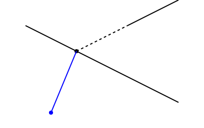

**Example 3** (**Super difficult**) What if the two lines above intersect at a point outside the page? Can we still draw a line from the given point to the intersection point?


Of course, if you image the point outside the page, you can still draw a line to it. **But actually constructing it using only a ruler is POSSIBLE! (You will learn it at the end of this chapter.)**

### More Basic Definitions
A **line segment** is a part of a line that is bounded by two distinct endpoints, and contains every point on the line between its endpoints.


A **ray** is a part of a line that starts at a point and extends infinitely in one direction.


An **angle** is formed by two rays (called the sides of the angle) that share a common endpoint (called the vertex of the angle).


A **flat angle** is an angle that measures exactly 180 degrees, formed when two rays extend in opposite directions from a common endpoint.


A **right angle** is an angle split the flat angle in half, often represented by a small square at the vertex of the angle.


In Euclidean geometry, an angle never exceeds a flat angle.


### Configurations of Lines
**Configurations of lines** are bsically the intersection patterns formed by multiple lines in a plane.

Let us start with one line that always divide the plane into two half-planes.

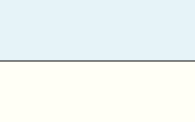

Next are two lines. They can either intersect at a point or be parallel. If they intersect, they divide the plane into four regions. If they are parallel, they divide the plane into three regions.

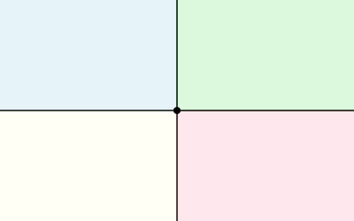

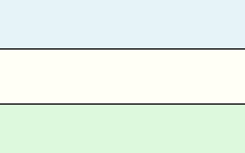

We view the first intersecting type in **general postion** while the second parallel type is a **special position**. If we can slightly move one of the parallel line, two lines will intersect. We call the special position **unstable**. Otherwise, it is **stable**.

Now consider three lines. We can add a third line to either of the above two configurations. When adding a third line into the intersecting two lines, we can place it so that it intersects both lines at different points (general position), intersects one of the lines (special position), or is parallel to both lines (special position).

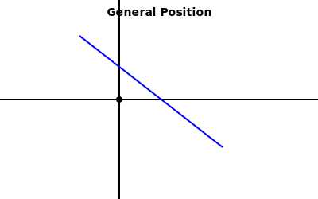

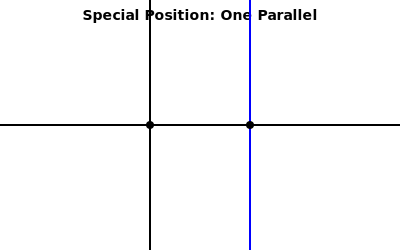

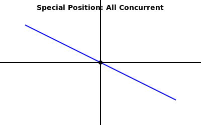

When adding a third line into the parallel two lines, we can place it so that it intersects both lines (general position), intersects one of the lines (special position), or is parallel to both lines (special position).

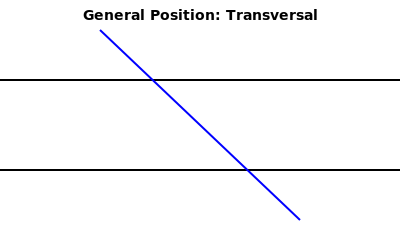

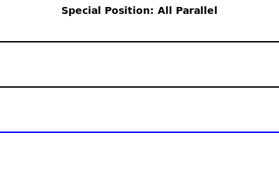

So in total we have 4 different configurations for three lines. And only the general position is stable. The other can be slightly perturbed to become the general position.

And only the stable configuration gives us a bounded region (a triangle in this case).

For four lines, there is only one stable configuration where no two lines are parallel and no three lines intersect at the same point. The stable one contains a quadrilateral. All other configurations are unstable.

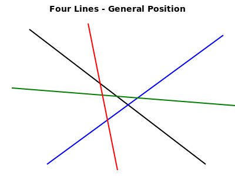


For five lines, there is more than one stable configuration. Here are two examples:

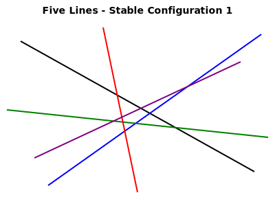

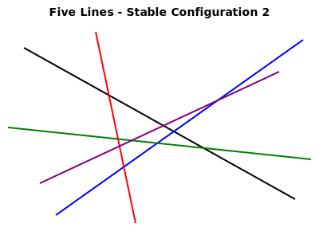

The first one looks more like a star. It contains 5 triangles and 1 pentagon. The second one contains 4 triangles and 2 quadrilateral. See the book page 28 for two more examples. 

