Lecture 10: Euclid's Elements Book I
---

#### Proposition 1 

This proposition is the beginning of Euclid's Elements, and it states that using compass and straightedge, we can construct an equilateral triangle on a given finite straight line. Remember this proposition! You will see it again and again in the next few sections.

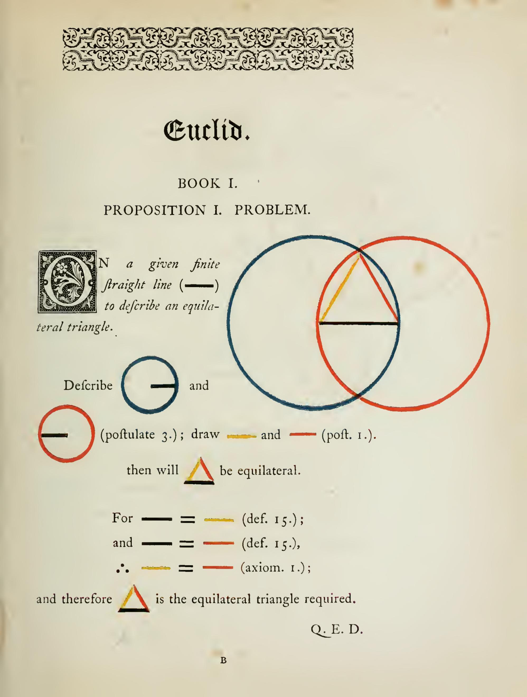

---

#### Proposition 4 — Theorem (SAS Congruence)

This is the famous SAS congruence theorem. All we need to know the two sides and the angle between them, we can determine the triangle up to congruence. This is a fundamental result in geometry, and it will be used repeatedly in the next few sections.

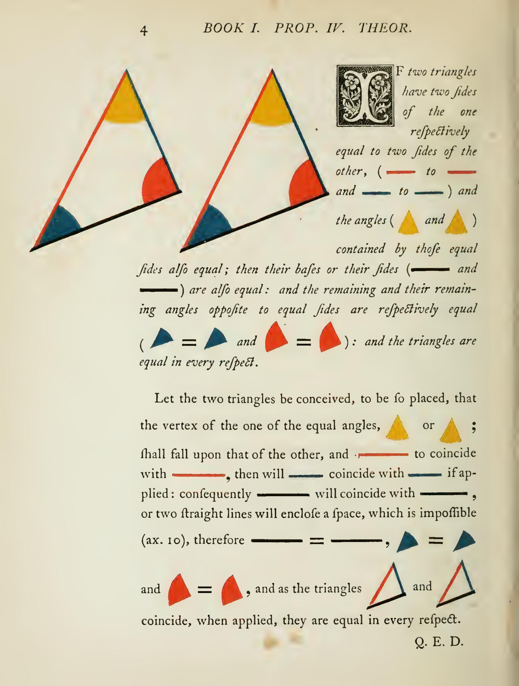

---

#### Proposition 5 — Theorem (Isosceles Triangle)

This is the famous isosceles triangle theorem, which states that in an isosceles triangle, the angles opposite to the equal sides are equal. The proof is tricky and try to read it through. Anther way to prove is to use symmetry. The triangle ABC is congruent to triangle ACB by SAS congruence, so the angles opposite to the equal sides are equal.

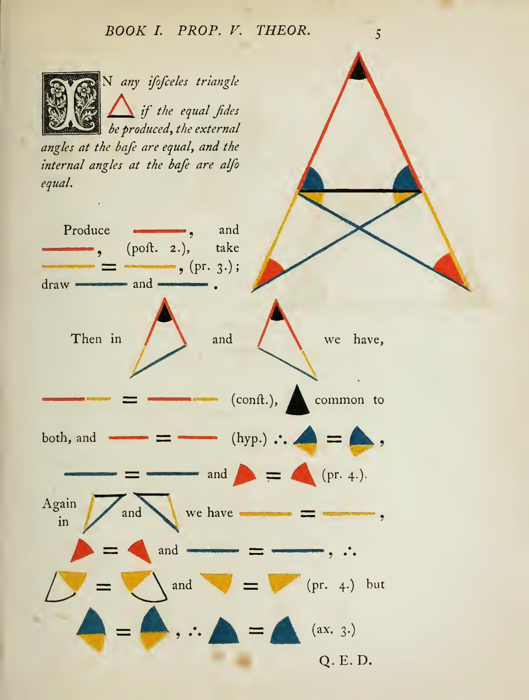

---

#### Proposition 8 — Theorem (SSS Congruence)

This is the famous SSS congruence theorem. All we need to know the three sides, we can determine the triangle up to congruence. See previous lecture for the proof of this theorem. SAS implies SSS.  

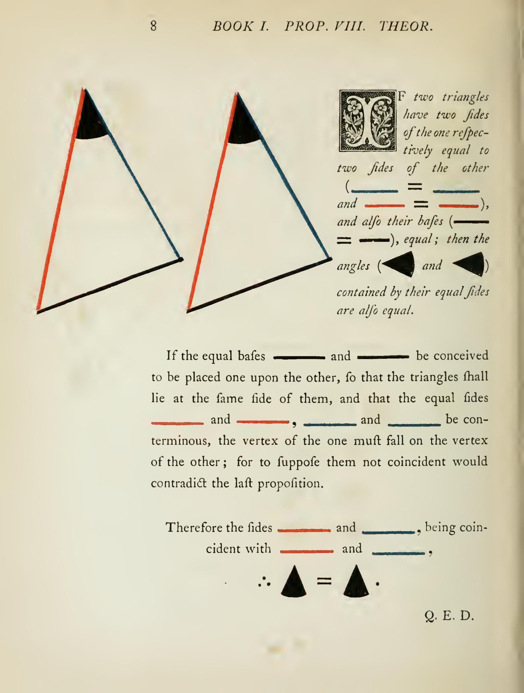

---

#### Proposition 9 

Starting from this proposition, we will use previous results to do geometric constructions. The first problem is to bisect a given angle. The idea is to use SSS congruence.

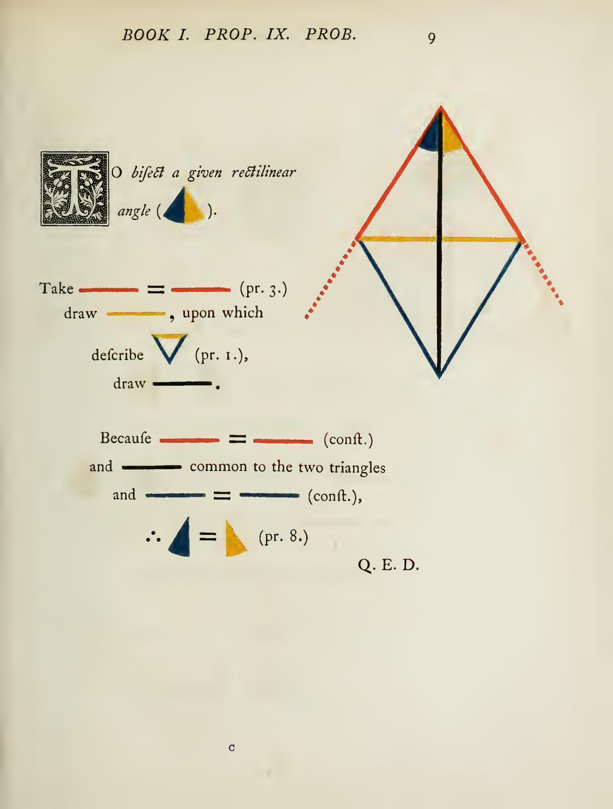

---

#### Proposition 10 

Next we will bisect a given finite straight line. The idea is to construct an equilateral triangle on the given line, and then bisect the angle opposite to the given line. Then apply the SAS.

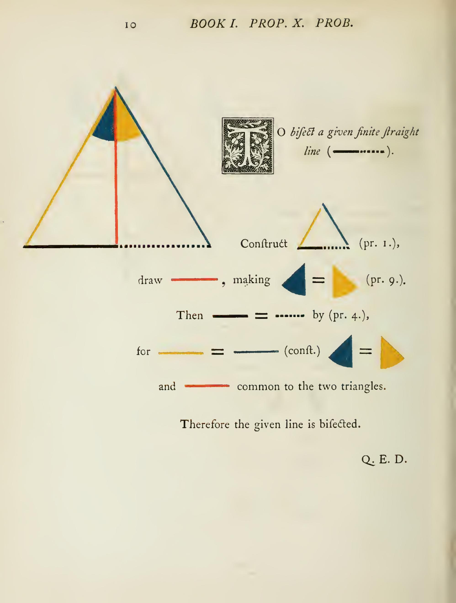

---

#### Proposition 11

The next problem is to draw a straight line perpendicular to a given finite straight line from a given point. The idea is to construct an equilateral triangle on the given line, and then bisect the angle opposite to the given line. Then apply the SAS.

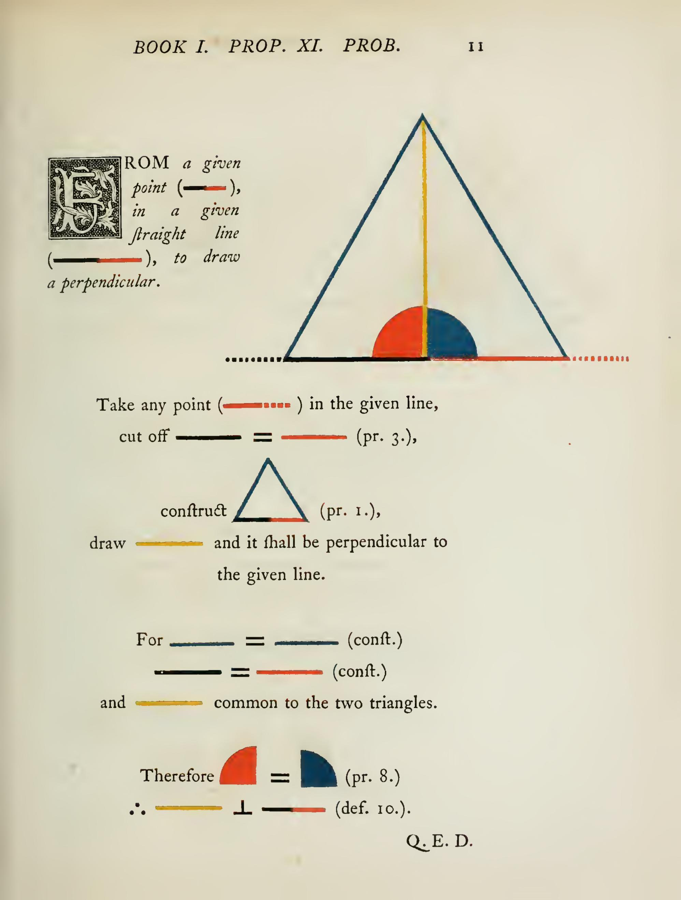

---

#### Proposition 12 — Problem

The next problem is to draw a straight line perpendicular to a given finite straight line from a point on the line.

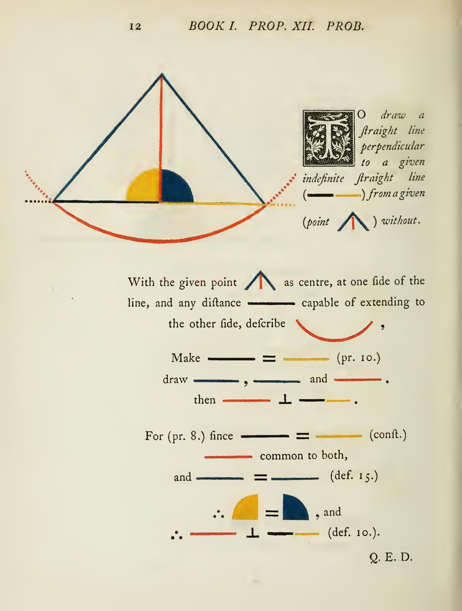

---

#### Proposition 15 — Theorem (Vertical Angles)

Now we move to angles and parallel lines. This is the famous vertical angles theorem, which states that when two straight lines intersect, the opposite (or vertical) angles are equal. The proof is easy.

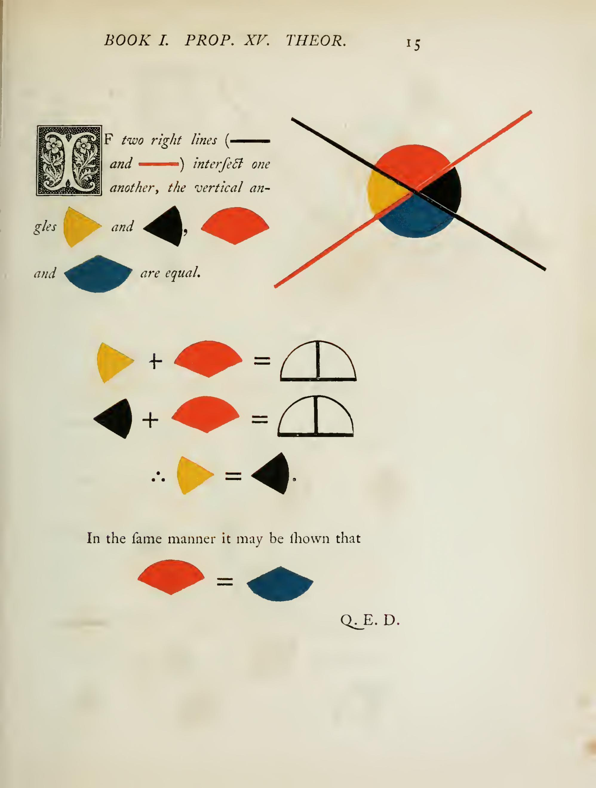

---

#### Proposition 27 

This is the famous alternate interior angles theorem, which states that if a straight line falling on two other straight lines makes the alternate angles equal to one another, those two straight lines are parallel. We will skip the proof for now and just think as a fact. 

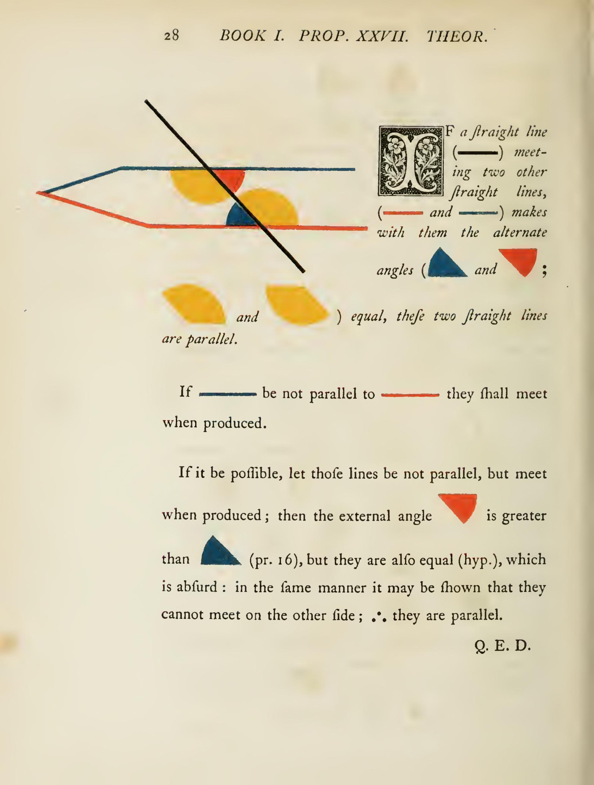

---

## Proposition 28 — Theorem

For a pair of parallel lines and another line intersecting them, we can define the **corresponding angles**, **alternate angles**, and **same-side angles**. 

For parallel lines, we have the following properties:
- Alternate angles are equal.
- Corresponding angles are equal.
- Same-side angles are supplementary (add up to 180 degrees).

Alternate angles equal imples corresponding angles equal by previous vertical angle theorem. Same-side angles supplementary implies corresponding angles equal, and vice versa.

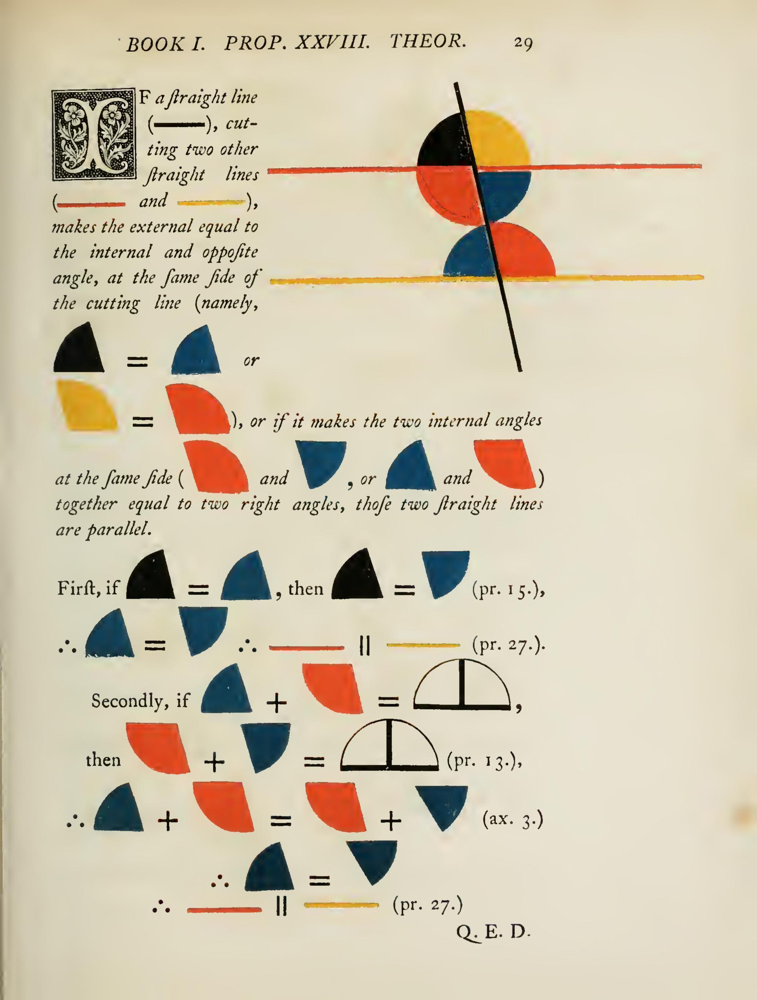

---

#### Proposition 30 

Below is the transitivity of parallel lines. If two lines are parallel to the same line, then they are parallel to each other. The proof is easy by using the alternate interior angles theorem. Proof is straightforward.

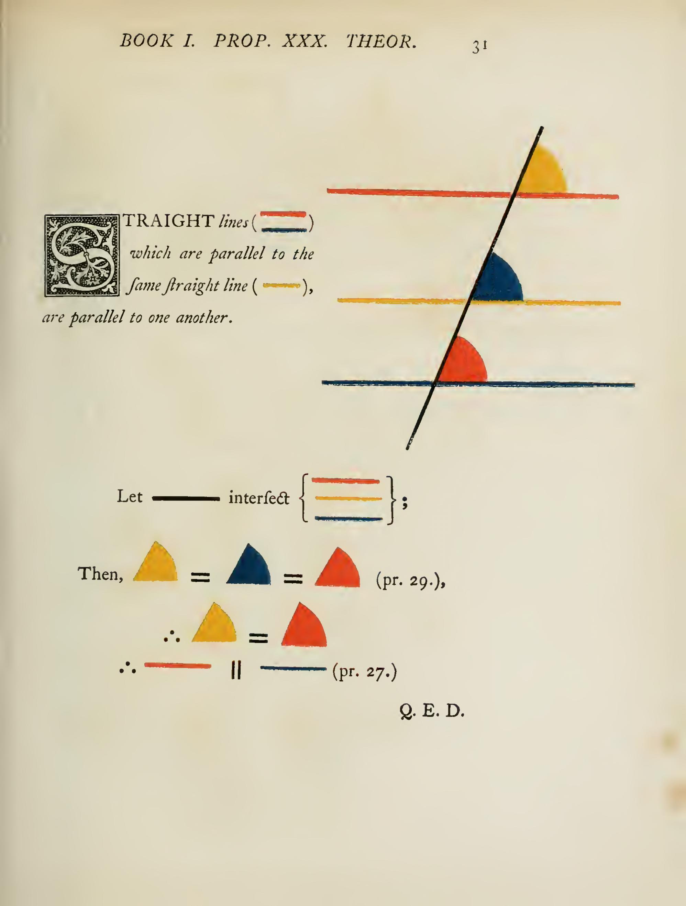

---

#### Proposition 32

Now the cumulative result of the previous propositions is that the sum of the angles in a triangle is equal to two right angles (180 degrees). The proof is to draw a line parallel to one side of the triangle through the opposite vertex, and then use the alternate interior angles theorem. I really like this proof, and it is very elegant.

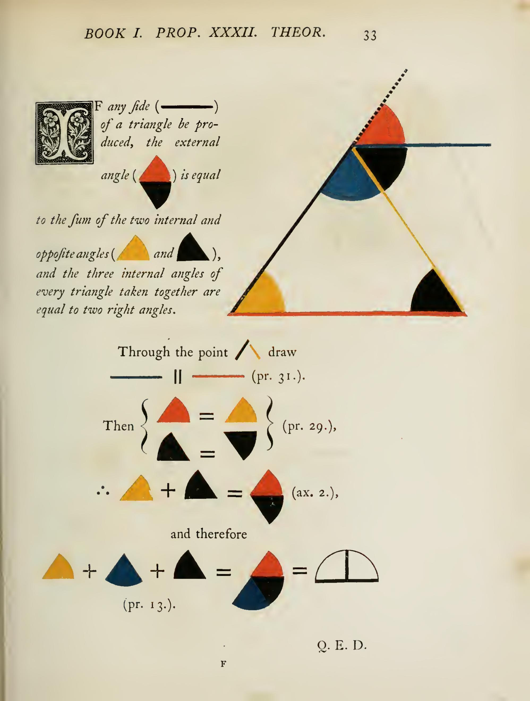
