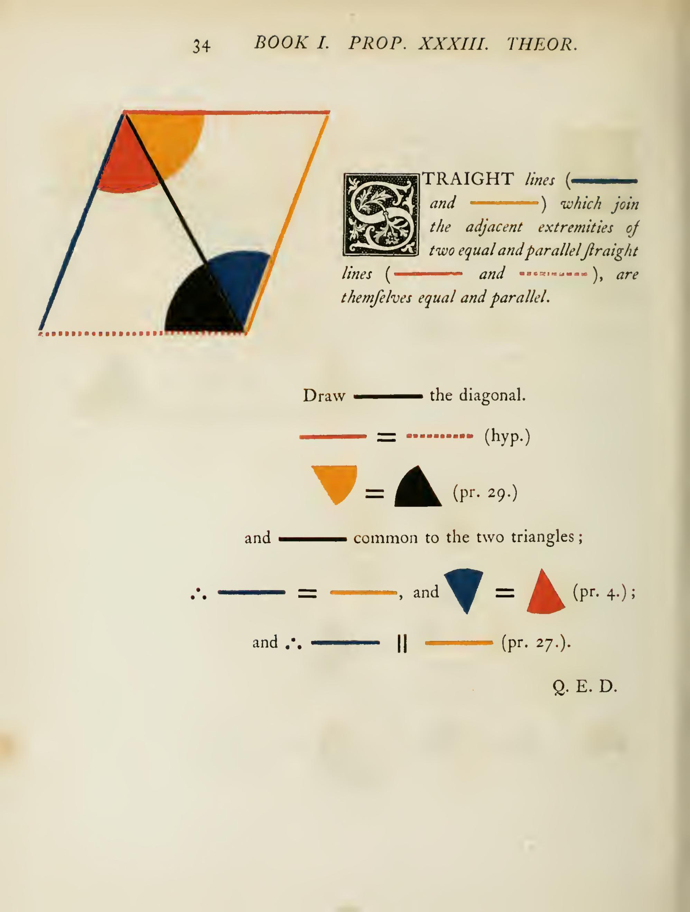
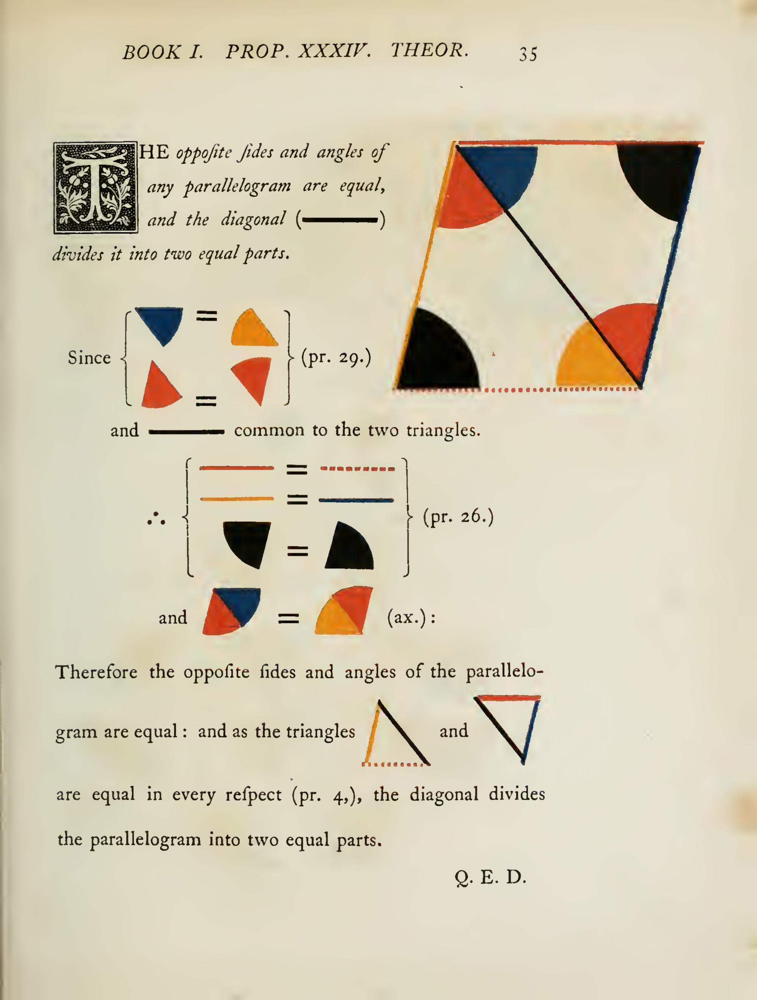
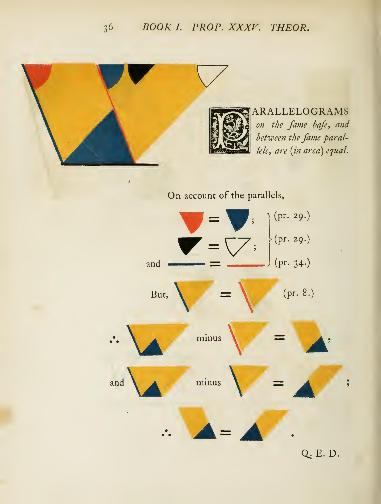
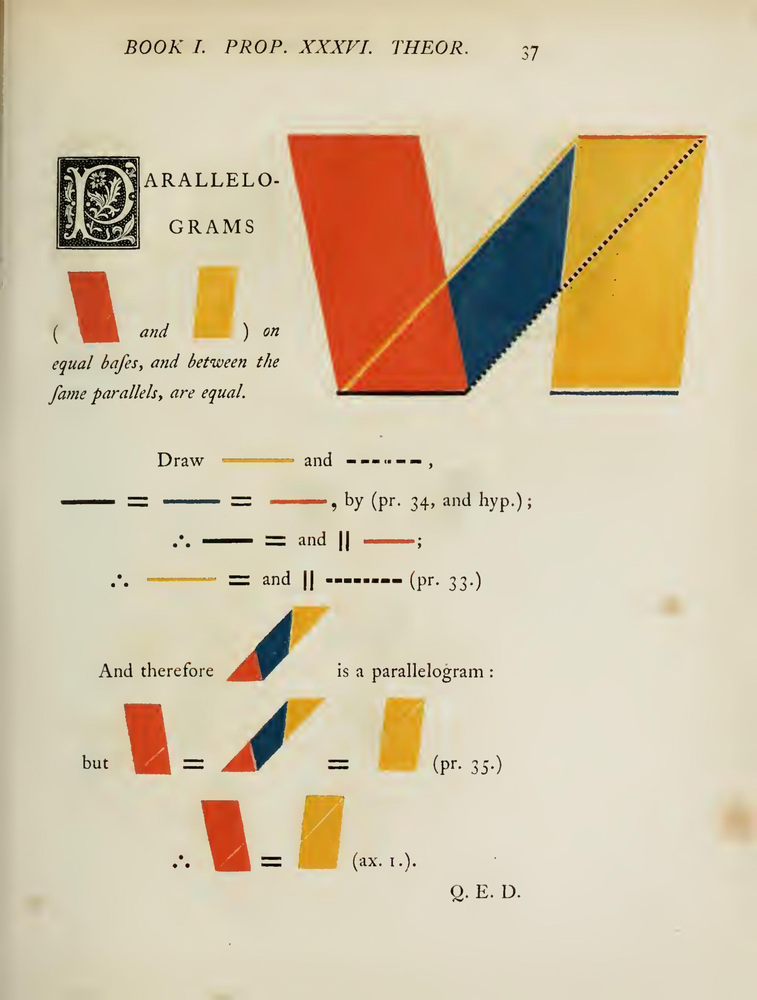
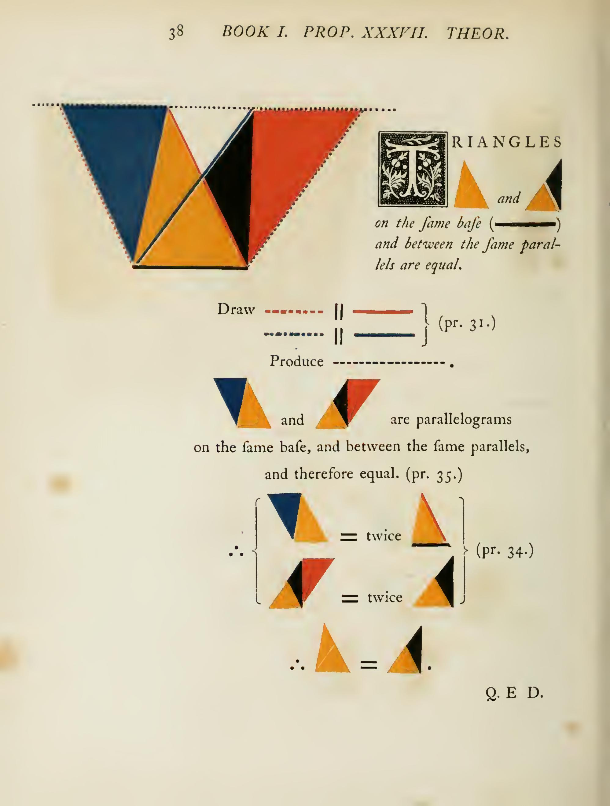
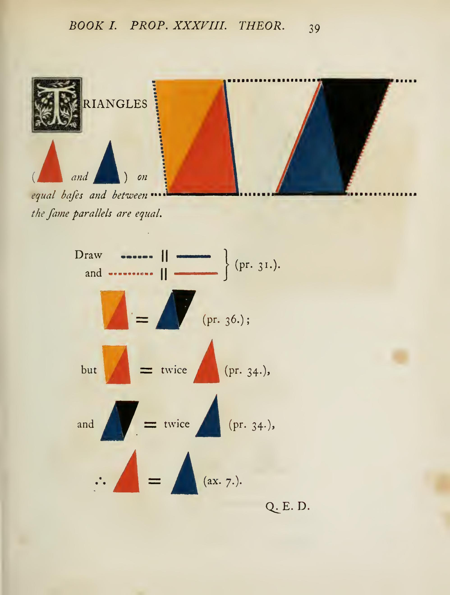
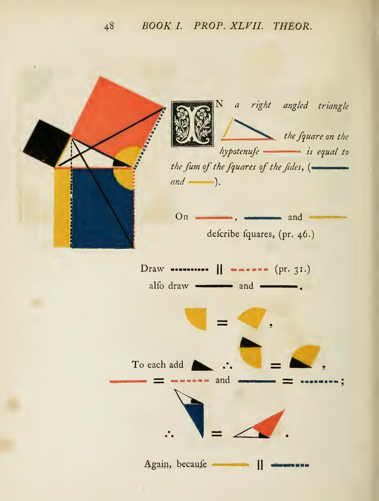
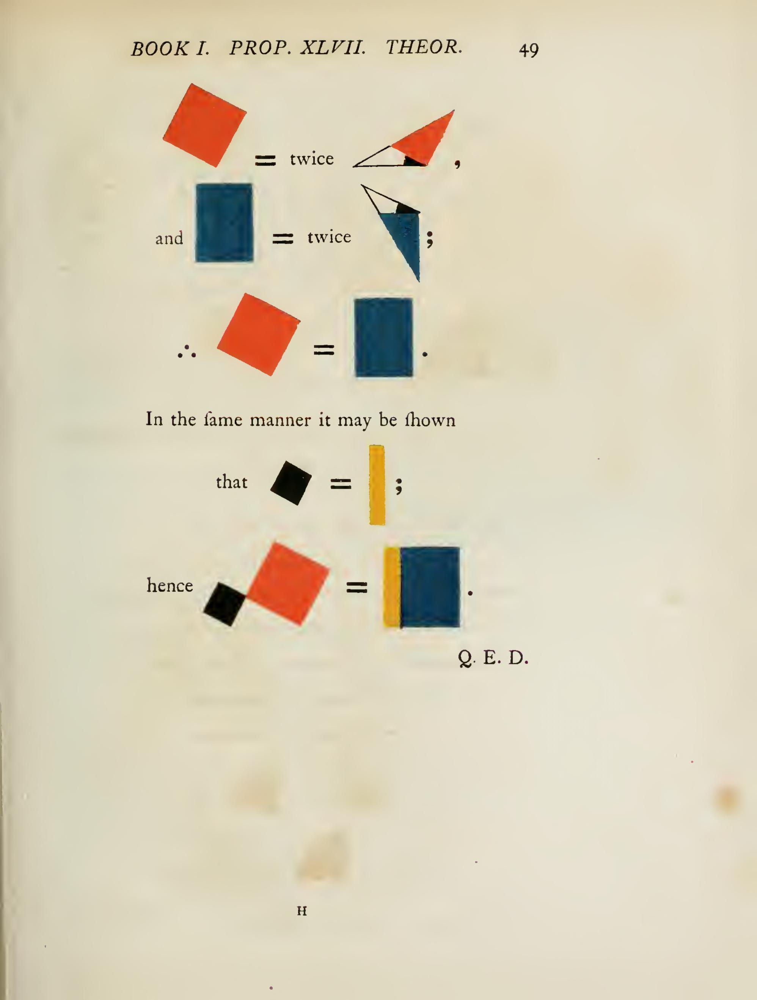
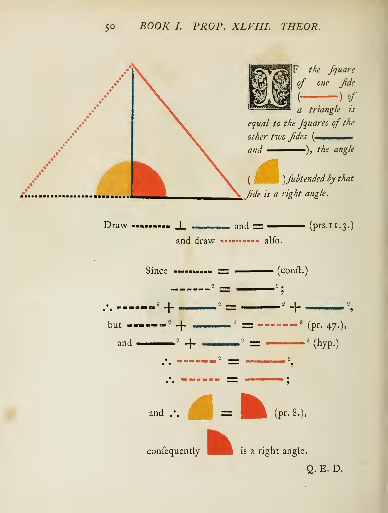

Lecture 11: Euclid's Elements Book I (Part 2)
---

#### Proposition 33

A **parallelogram** is a quadrilateral with both pairs of opposite sides parallel. In this proposition, we will show that it suffices to check one pair of opposite sides to be parallel and of equal length. The proof uses SAS.

---

#### Proposition 34

This tells us opposite sides and opposite angles of a parallelogram are equal. The proof uses the previous proposition and the ASA congruence.

---

#### Proposition 35

Parallelograms on the same base and between the same parallel lines are equal in area. This is a surprising result because the parallelograms can look very different from each other, yet they enclose the same area. The proof uses ASA. And indeed Euclid has not even introduced the concept of area yet, so this is a purely geometric result about the relative sizes of these parallelograms.

---

#### Proposition 36

Parallelograms on equal bases and between the same parallel lines are equal in area. This generalizes Proposition 35 — the base no longer needs to be the same segment, just the same length. The proof reduces to Proposition 35 by connecting the bases.

---

#### Proposition 37

Triangles on the same base and between the same parallel lines are equal in area. This follows immediately from Proposition 35: any triangle is half of a parallelogram on the same base, and Prop 35 tells us those parallelograms are equal.

---

#### Proposition 38

Triangles on equal bases and between the same parallel lines are equal in area. This is the triangle version of Proposition 36, and follows by the same argument as Proposition 37 using Proposition 36.

---

#### Proposition 47 — Theorem (Pythagorean Theorem)

This is one of the most famous theorems in all of mathematics. In a right-angled triangle, the square on the hypotenuse equals the sum of the squares on the other two sides. Euclid's proof is beautiful: he draws the squares on each side and shows the areas match by repeatedly applying congruent triangles and Proposition 41 (parallelogram equals twice a triangle on same base). This is a stunning culmination of Book I.

---

#### Proposition 48 — Theorem (Converse of Pythagorean Theorem)

If the square on one side of a triangle equals the sum of the squares on the other two sides, then the angle opposite that side is a right angle. This is the converse of Proposition 47, and the proof constructs a right triangle with the same legs and uses SSS congruence to conclude the original triangle must also have a right angle.

