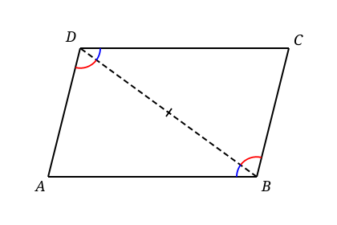
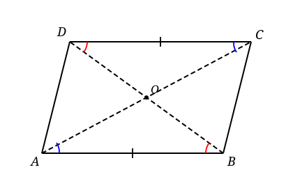
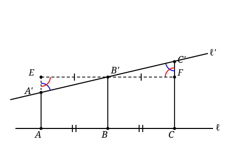
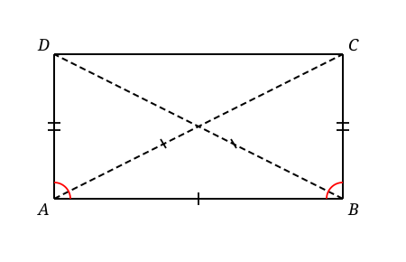
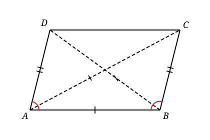
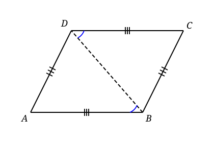
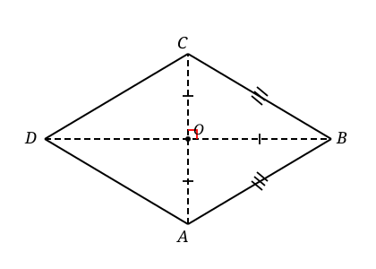

### Lecture 12: More on Parallelograms

#### Parallelograms
A **parallelogram** is a quadrilateral with both pairs of opposite sides parallel. 

**Proposition 1**: A parallelogram has opposite sides equal in length and opposite angles equal.

**Proof**:
- Draw diagonal $BD$, splitting $ABCD$ into $\triangle ABD$ and $\triangle CDB$.
- Since $AB \parallel CD$ and $AD \parallel BC$, the Alternate Interior Angles Theorem gives $\angle ABD = \angle CDB$ and $\angle ADB = \angle CBD$, with $BD$ shared.
- **ASA**: two angles and the diagonal $BD$ match, so $\triangle ABD \cong \triangle CDB$.
- **Conclusion**: corresponding parts are equal, giving $AB = CD$, $AD = BC$, and $\angle BAD = \angle BCD$, $\angle ABC = \angle CDA$. $\blacksquare$

**Proposition 2**: A quadrilateral with one pair of opposite sides parallel and equal in length is a parallelogram.

**Proof**:
- Let $AB \parallel CD$ and $AB = CD$.
- Draw diagonal $BD$, splitting $ABCD$ into $\triangle ABD$ and $\triangle CDB$.
- Since $AB \parallel CD$, the Alternate Interior Angles Theorem gives $\angle ABD = \angle CDB$.
- **SAS**: Since $AB = CD$ and $BD$ is shared, we have two sides and the included angle equal. So $\triangle ABD \cong \triangle CDB$.
- **Conclusion**: $\angle ADB = \angle CBD$, so $AD \parallel BC$ by the converse of the Alternate Interior Angles Theorem. Thus $ABCD$ is a parallelogram. $\blacksquare$

**Proposition 3**: The diagonals of a parallelogram bisect each other.

**Proof**:
- Let $ABCD$ be a parallelogram, and let the diagonals $AC$ and $BD$ intersect at $O$. We need to show that $O$ is the midpoint of both diagonals, i.e. $AO = OC$ and $BO = OD$.
- We want to find two pairs of triangles that are congruent. Consider $\triangle AOB$ and $\triangle COD$.
- Since $ABCD$ is a parallelogram, we have $AB \parallel CD$. This gives us $\angle OAB = \angle OCD$ and $\angle OBA = \angle ODC$ by the Alternate Interior Angles Theorem.
- We also have $AB = CD$ by Proposition 1. Thus, by **ASA**, we have $\triangle AOB \cong \triangle COD$.
- From the congruence, we get $AO = OC$ and $BO = OD$. $\blacksquare$

**Proposition 4**: Parallel projections of equal segments are equal.

**Proof**:
- Construct a parallel line through $B'$ which intersects the line $AA'$ at $E$ and the line $CC'$ at $F$. 
- Since $EABB'$ and $B'BCF$ are parallelograms, by **Proposition 1**, we have $EB' = AB$ and $B'F = BC$. Thus, $EB' = B'F$.
- Now we want to prove $\triangle A'B'E \cong \triangle C'B'F$. Indeed, by **ASA**, we have $\angle B'A'E = \angle B'FC'$, $\angle B'EA' = \angle B'C'F$ and $EB' = B'F$. Thus, $\triangle A'B'E \cong \triangle C'B'F$.
- From the congruence, we get $A'B' = C'B'$. $\blacksquare$

### Retangles
A **rectangle** is a parallelogram with four right angles. 

**Lemma 5**: A parallelogram with one right angle is a rectangle.

**Proof**:
- Let $ABCD$ be a parallelogram with $\angle ABC = 90^\circ$. We want to show that all angles are right angles.
- Since $AB \parallel CD$, the same side of the transversal $BC$ gives $\angle ABC + \angle BCD = 180^\circ$. Since $\angle ABC = 90^\circ$, we have $\angle BCD = 90^\circ$. Similar arguments show that $\angle CDA = 90^\circ$ and $\angle DAB = 90^\circ$. Thus, $ABCD$ is a rectangle. $\blacksquare$

**Proposition 6**: The diagonals of a rectangle are equal in length.

**Proof**:
- Let $ABCD$ be a rectangle, and let the diagonals $AC$ and $BD$ intersect at $O$. We want to show that $AC = BD$.
- Consider $\triangle ABC$ and $\triangle ABD$. Since $ABCD$ is a rectangle, we have $\angle ABC = \angle ABD = 90^\circ$. We also have $AB$ shared and $BC = AD$ by Proposition 1. Thus, by **SAS**, we have $\triangle ABC \cong \triangle ABD$.
- From the congruence, we get $AC = BD$. $\blacksquare$

**Proposition 7**: A parallelogram with equal diagonals is a rectangle.

**Proof**:
- Let $ABCD$ be a parallelogram with $AC = BD$. We want to show that $ABCD$ is a rectangle.
- Consider $\triangle ABC$ and $\triangle ABD$. Since $ABCD$ is a parallelogram, we have $AB$ shared and $BC = AD$ by Proposition 1. We also have $AC = BD$ by assumption. Thus, by **SSS**, we have $\triangle ABC \cong \triangle ABD$.
- From the congruence, we get $\angle ABC = \angle DAB$. Since these two angles are supplementary, we have $\angle ABC = \angle DAB = 90^\circ$. Thus, $ABCD$ is a rectangle by Lemma 5. $\blacksquare$

### Rhombuses
A **rhombus** is a parallelogram with four equal sides.

**Proposition 8**: A quadrilateral with two pairs of equal opposite edges, in particular, A rhombus, is a parallelogram. 

**Proof**:
- Draw diagonal $BD$, splitting $ABCD$ into $\triangle ABD$ and $\triangle BDC$. Since $AB = CD$, $AD=BC$ and $BD$ is shared, by **SSS**, we have $\triangle ABD \cong \triangle BDC$. In particular, we have $\angle ABD = \angle BDC$. Since these two angles are alternate interior angles with respect to the transversal $BD$, we have $AB \parallel CD$. Similarly, we can show $AD\parallel BC$. $\blacksquare$

**Proposition 9**: The diagonals of a rhombus are perpendicular.

**Proof**:
- Let $ABCD$ be a rhombus, and let the diagonals $AC$ and $BD$ intersect at $O$. We want to show that $AC \perp BD$.
- Consider $\triangle AOB$ and $\triangle BOC$. We have $OB$ shared and $AB = BC$ by definition of a rhombus. We also have $AO = OC$ by Proposition 3 and 8. Thus, by **SSS**, we have $\triangle AOB \cong \triangle BOC$. From the congruence, we get $\angle AOB = \angle BOC$. Since these two angles are supplementary, we have $\angle AOB = \angle BOC = 90^\circ$. Thus, $AC \perp BD$. $\blacksquare$

**Proposition 10**: A parallelogram with perpendicular diagonals is a rhombus.

**Proof**:
- Let $ABCD$ be a parallelogram with $AC \perp BD$. We want to show that $ABCD$ is a rhombus.
- Consider $\triangle AOB$ and $\triangle BOC$. We have $OB$ shared and $AO = OC$ by Proposition 3. We also have $\angle AOB = \angle BOC = 90^\circ$ by assumption. Thus, by **SAS**, we have $\triangle AOB \cong \triangle BOC$. From the congruence, we get $AB = BC$. Similarly, we can show $AD = DC$. Thus, $ABCD$ is a rhombus. $\blacksquare$

### Squares
A **square** is a parallelogram with four equal sides and four right angles. In other words, a square is both a rectangle and a rhombus. It satisfies all the properties of both rectangles and rhombuses. 

**Proposition 11**: The two diagonals cut a square into four congruent $45^\circ$ right triangles.

This leaves as an exercise to the reader.