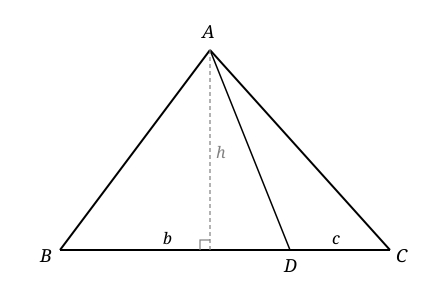
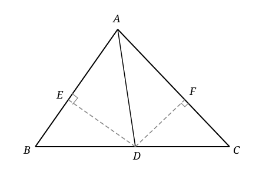

### Lecture 13: Area and Triangles

**Area of a Triangle**: The area of a triangle is the half of the parallelogram formed by doubling the triangle along one of its sides. If we take a triangle with base $b$ and height $h$, the area is given by:  

$$ A = \frac{1}{2} a h $$

**Lemma 1**: Let $ABC$ be a triangle, and let $D$ be a point on the line $BC$. Then we have the area ratio formula:
$$ \frac{S_{\Delta ABD}}{S_{\Delta ADC}} = \frac{BD}{DC}$$

**Proof**:
- Let $h$ be the height of $\triangle ABC$ with respect to the base $BC$,  $b=BD$ and $c=DC$. 
- Then we have $S_{\Delta ABD} = \frac{1}{2} b h$ and $S_{\Delta ADC} = \frac{1}{2} c h$. Thus, we have 
$$\frac{S_{\Delta ABD}}{S_{\Delta ADC}} = \frac{\frac{1}{2} b h}{\frac{1}{2} c h} =\frac{BD}{DC}.$$ $\blacksquare$

**Theorem 2 (Bisector theorem)** : Let $ABC$ be a triangle, and let $AD$ be the bisector of $\angle BAC$. Then we have the length ratio formula:
$$ \frac{BD}{DC} = \frac{AB}{AC}$$

Conversely, if $D$ is a point on the line $BC$ such that $\frac{BD}{DC} = \frac{AB}{AC}$, then $AD$ is the bisector of $\angle BAC$.

**Proof**:
- Draw two altitudes from $D$ to the lines $AB$ and $AC$, and let the feet of the altitudes be $E$ and $F$, respectively. 
- First we show that $\Delta AED$ is congruent to $\Delta AFD$. Indeed, by **ASA**, we have $\angle EAD = \angle FAD$, $\angle ADE = \angle ADF$ and $AD$ shared. Thus, $\Delta AED \cong \Delta AFD$. From the congruence, we get $DE = DF$.
- Now we have $$\frac{BD}{DC} = \frac{S_{\Delta ABD}}{S_{\Delta ADC}} = \frac{\frac{1}{2}DE.AB}{\frac{1}{2}DF.AC} = \frac{AB}{AC}$$ 
- Conversely, if $\frac{BD}{DC} = \frac{AB}{AC}$, then we have $DE = DF$ by the same area ratio formula. Now $AE=AF$ by the Pythagorean theorem, and $AD$ is shared. Thus, $\Delta AED \cong \Delta AFD$ by **SSS**, which implies that $\angle EAD = \angle FAD$. Thus, $AD$ is the bisector of $\angle BAC$. $\blacksquare$

**Lemma 3 (Seva's Lemma)**: With the same setup as in Lemma 1, and let $P$ be a point on the line $AD$. Then we have the area ratio formula:
$$ \frac{S_{\Delta ABP}}{S_{\Delta ACP}} = \frac{BD}{DC}$$

**Proof**:
- By Lemma 1, we have $$\frac{S_{\Delta BDP}}{S_{\Delta DCP}} = \frac{S_{\Delta ABD}}{S_{\Delta ADC}} = \frac{BD}{DC}$$
- So the difference of the two triangles also satisfies the same ratio, i.e. $$\frac{S_{\Delta ABP}}{S_{\Delta ACP}} = \frac{BD}{DC}$$ $\blacksquare$

**Theorem 4 (Seva's Theorem)**: Let $ABC$ be a triangle, and let $P$ be a point in the interior of $\triangle ABC$. Let $D$, $E$ and $F$ be the intersections from $AP$, $BP$ and $CP$ to the lines $BC$, $CA$ and $AB$, respectively. Then we have the following product formula:
$$ \frac{BD}{DC} \cdot \frac{CE}{EA} \cdot \frac{AF}{FB} = 1$$

Conversely, if $D$, $E$ and $F$ are points on the lines $BC$, $CA$ and $AB$ such that the above product formula holds, then the lines $AD$, $BE$ and $CF$ are concurrent.

**Proof**:
- By Lemma 3, we have $$\frac{S_{\Delta ABP}}{S_{\Delta ACP}} = \frac{BD}{DC}, \quad \frac{S_{\Delta BCP}}{S_{\Delta ABP}} = \frac{CE}{EA}, \quad \frac{S_{\Delta CAP}}{S_{\Delta BCP}} = \frac{AF}{FB}$$
- Multiplying the three equations together, we get $$\frac{BD}{DC} \cdot \frac{CE}{EA} \cdot \frac{AF}{FB} = \frac{S_{\Delta ABP}}{S_{\Delta ACP}} \cdot \frac{S_{\Delta BCP}}{S_{\Delta ABP}} \cdot \frac{S_{\Delta CAP}}{S_{\Delta BCP}} = 1$$ 
- Conversely, if the product formula holds, then we can construct $P$ as intersection of $AD$ and $BE$, then $CP$ intersects $AB$ at $F'$ cutting $AB$ at the same ratio. So $F=F'$. $\blacksquare$
$\blacksquare$

**Theorem 5**: Three medians of a triangle intersect at a single point (the **centroid**).

**Proof**:
- Since $D$ is the midpoint of $BC$, we have $\frac{BD}{DC} = 1$. Similarly, we have $\frac{CE}{EA} = 1$ and $\frac{AF}{FB} = 1$. Thus, the Ceva product is $$\frac{BD}{DC} \cdot \frac{CE}{EA} \cdot \frac{AF}{FB} = 1$$
- By the converse of Seva's theorem (Theorem 4), the three medians are concurrent. $\blacksquare$

**Theorem 6**: The three bisectors of a triangle intersect at a single point (the **incenter**).

**Proof**:
- The bisector theorem gives us $\frac{BD}{DC} = \frac{AB}{AC}$, $\frac{CE}{EA} = \frac{BC}{AB}$ and $\frac{AF}{FB} = \frac{AC}{BC}$. Multiplying the three equations together, we get $$\frac{BD}{DC} \cdot \frac{CE}{EA} \cdot \frac{AF}{FB} = 1$$
- By the converse of Seva's theorem (Theorem 4), the three bisectors are concurrent. $\blacksquare$

**Theorem 7**: The three altitudes of a triangle intersect at a single point (the **orthocenter**).

**Proof**:
- Let $D$, $E$, $F$ be the feet of the altitudes from $A$, $B$, $C$ to sides $BC$, $CA$, $AB$. From the right triangles at each foot: $BD = c\cos B$, $DC = b\cos C$, $CE = a\cos C$, $EA = c\cos A$, $AF = b\cos A$, $FB = a\cos B$.
- Thus the Ceva product is $$\frac{BD}{DC}\cdot\frac{CE}{EA}\cdot\frac{AF}{FB} = \frac{c\cos B}{b\cos C}\cdot\frac{a\cos C}{c\cos A}\cdot\frac{b\cos A}{a\cos B} = 1.$$
- By the converse of Ceva's theorem (Theorem 4), the three altitudes are concurrent. $\blacksquare$

**Remark:**
- the orthocenter can be outside the triangle, but the altitudes still intersect at a single point. So Ceva's theorem does not directly imply the concurrency of altitudes.
- Formula the Ceva's theorem for a point outside the triangle, and use it to show that the altitudes of an obtuse triangle are concurrent.