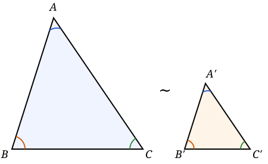
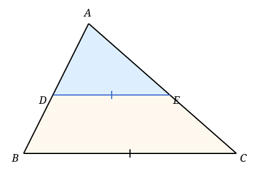
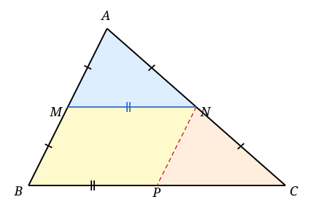
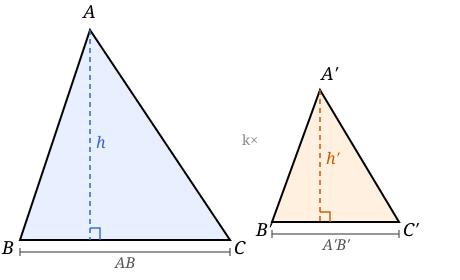
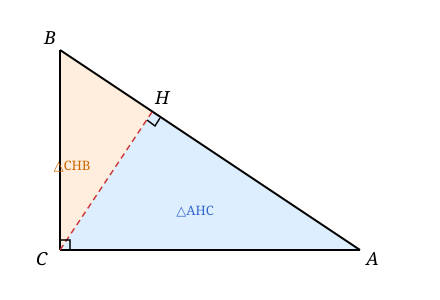
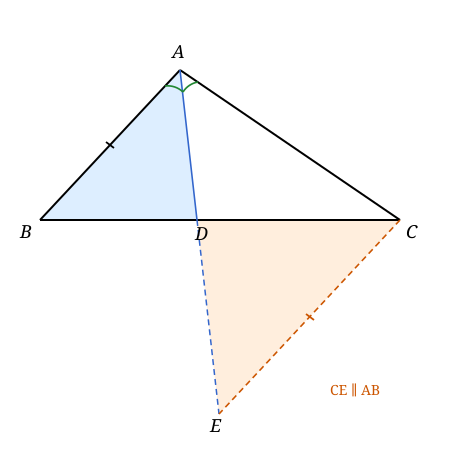

### Lecture 14: Similar Triangles

### Definition

Two triangles $ABC$ and $A'B'C'$ are **similar**, written $\triangle ABC \sim \triangle A'B'C'$, if their corresponding angles are equal:
$$\angle A = \angle A', \quad \angle B = \angle B', \quad \angle C = \angle C'.$$

**Theorem 1 (AA)**: Two triangles are similar if two pairs of corresponding angles are equal.

**Proof**: The angle sum in any triangle is $180°$, so equality of two pairs forces the third pair to be equal as well. $\blacksquare$

**Theorem 2**: If $\triangle ABC \sim \triangle A'B'C'$, then the corresponding sides are proportional:
$$\frac{AB}{A'B'} = \frac{BC}{B'C'} = \frac{CA}{C'A'}.$$

The common ratio is called the **scale factor** $k$.

This theorem is proved using the following lemma by moving one triangle on top of the other and applying the Basic Proportionality Theorem (also known as Thales' theorem).

**Lemma (Basic Proportionality Theorem / Thales)**: Let $\triangle ABC$ be a triangle. If a line parallel to $BC$ meets $AB$ at $D$ and $AC$ at $E$, then
$$\frac{AD}{AB} = \frac{AE}{AC}=\frac{DE}{BC} .$$

We only prove the basic proportionality theorem in a special case.

**Special case (Bimedian Theorem)**: Let $M$ be the midpoints of side $AB$ of $\triangle ABC$. If $MN \parallel BC$, then $MN = \dfrac{1}{2}BC$ and $N$ is the mid point of $AC$.

**Proof**:
- Construct the parallel line to $AB$ through $N$. So we get a parallelogram $BPNM$. It implies that $MN=BP$ and $BM=NP$.
- Since $NP \parallel AB$, we have $\angle CAB=\angle CNP$ and $\angle ABC=\angle NPC$. By AAS, $\triangle AMN \cong \triangle NPC$. In particular, $AN=NP$ and $PC=MN$.
- This implies that $N$ is the midpoint of $AC$ and $MN=BP=PC=\dfrac{1}{2}BC$. $\blacksquare$

### Theorem 3: Area Ratio

**Theorem 3**: If $\triangle ABC \sim \triangle A'B'C'$ with scale factor $k$, then
$$\frac{S_{\triangle ABC}}{S_{\triangle A'B'C'}} = k^2.$$

**Proof**:
- Let $h$ and $h'$ be the altitudes from $C$ and $C'$ to $AB$ and $A'B'$ respectively. The foot of each altitude together with the two base vertices forms a right triangle. Since $\angle A = \angle A'$, these right triangles are similar with ratio $k$, giving $h / h' = k$.
- Therefore:
$$\frac{S_{\triangle ABC}}{S_{\triangle A'B'C'}} = \frac{\tfrac{1}{2} \cdot AB \cdot h}{\tfrac{1}{2} \cdot A'B' \cdot h'} = \frac{AB}{A'B'} \cdot \frac{h}{h'} = k \cdot k = k^2.$$ $\blacksquare$

### Theorem 4: Right Triangle Altitude Theorem

**Theorem 4**: In a right triangle $ABC$ with $\angle C = 90°$, let $H$ be the foot of the altitude from $C$ to the hypotenuse $AB$. Then:
1. $\triangle ACB \sim \triangle AHC \sim \triangle CHB$.
2. $CH^2 = AH \cdot HB$.
3. $AC^2 = AH \cdot AB$ and $BC^2 = BH \cdot AB$.

**Proof**:
- In $\triangle AHC$ and $\triangle ACB$: $\angle A$ is shared and $\angle AHC = \angle ACB = 90°$. By AA, $\triangle AHC \sim \triangle ACB$.
- In $\triangle CHB$ and $\triangle ACB$: $\angle B$ is shared and $\angle CHB = 90°$. By AA, $\triangle CHB \sim \triangle ACB$.
- Hence all three triangles are mutually similar. Reading off the proportional sides:
$$\frac{AH}{AC} = \frac{AC}{AB} \implies AC^2 = AH \cdot AB,$$
$$\frac{BH}{BC} = \frac{BC}{AB} \implies BC^2 = BH \cdot AB,$$
$$\frac{AH}{CH} = \frac{CH}{HB} \implies CH^2 = AH \cdot HB.$$ $\blacksquare$

**Corollary 1**: The altitude $CH$ is the geometric mean of the two segments $AH$ and $HB$ into which it divides the hypotenuse.

**Pythagorean Theorem**: $$AC^2 + BC^2 = AB^2.$$

**Proof**: From the above, we have $AC^2 + BC^2 = AH \cdot AB + BH \cdot AB = AB \cdot (AH + BH) = AB^2$.

**Bisector Theorem**: In $\triangle ABC$, if $AD$ is the bisector of $\angle A$ meeting $BC$ at $D$, then
$$\frac{BD}{DC} = \frac{AB}{AC}.$$

**Proof**: Construct the parallel line to $AB$ through $C$. Let it meet the extension of $AD$ at $E$. Then $\angle BAC = \angle ECD$ and $\angle ABC = \angle EDC$. By AA, we have $$\triangle ABD \sim \triangle ECD$$ giving $$\frac{BD}{DC} = \frac{AB}{EC}.$$
Now the bisection of $\angle A$ implies that $\angle BAD = \angle DAC$. So $\angle DAC = \angle AEC$. The isoceles triangle $AEC$ has $AC=CE$. Therefore $$\frac{BD}{DC} = \frac{AB}{AC}.$$