### Lecture 15: Topics in Circles

---

### Part 1: How Many Circles Pass Through Given Points?

### One Point

Given a single point $A$, infinitely many circles pass through $A$: we can choose any center and any radius as long as the circle passes through $A$.

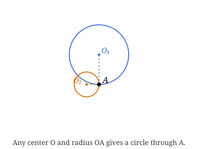

### Two Points

Given two distinct points $A$ and $B$, we can still draw infinitely many circles through both. Every such circle's center must be **equidistant** from $A$ and $B$, so the centers all lie on a special line.

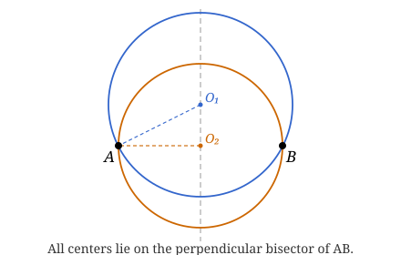

This motivates the following definition.

**Definition (Perpendicular Bisector)**: The **perpendicular bisector** of a segment $AB$ is the line that passes through the midpoint $M$ of $AB$ and is perpendicular to $AB$.

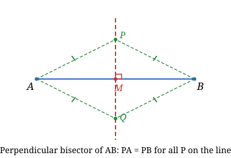

**Lemma**: A point $P$ lies on the perpendicular bisector of $AB$ if and only if $PA = PB$.

**Proof**:
- ($\Rightarrow$) Suppose $P$ is on the perpendicular bisector. Then $\triangle PMA \cong \triangle PMB$ by **SAS** ($PM$ shared, $\angle PMA = \angle PMB = 90°$, $MA = MB$). Hence $PA = PB$.
- ($\Leftarrow$) Suppose $PA = PB$. Then $\triangle PMA$ and $\triangle PMB$ share $PM$, have $MA = MB$, and $PA = PB$. By **SSS**, the two triangles are congruent, so $\angle PMA = \angle PMB$. Since they are supplementary, $\angle PMA = 90°$, meaning $P$ lies on the perpendicular bisector. $\blacksquare$

**Corollary**: Given two points $A$ and $B$, the centers of all circles passing through both $A$ and $B$ lie exactly on the perpendicular bisector of $AB$. Hence there are infinitely many such circles.

### Three Points

If we are given three points $A$, $B$, $C$, how many circles pass through all three? If $A$, $B$, $C$ are collinear, no circle passes through all three (a circle and a line meet in at most 2 points).

Given three **non-collinear** points $A$, $B$, $C$, how many circles pass through all three?

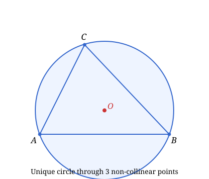

**Theorem 1**: Given three non-collinear points, there is exactly one circle passing through all three.

**Proof**:
The idea is to reduce to the two-point case. First we construct the perpendicular bisectors $\ell_1$ and $\ell_2$ of $AB$ and $BC$. By the Lemma, any center of a circle passing through $A$, $B$, $C$ must lie on both $\ell_1$ and $\ell_2$. They intersect at a unique point $O$. Setting $r = OA=OB=OC$, the circle centered at $O$ with radius $r$ passes through $A$, $B$, $C$.

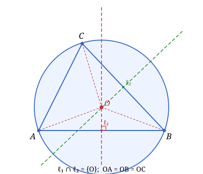

Since any center must lie on $\ell_1 \cap \ell_2 = \{O\}$, so the center and radius are determined. $\blacksquare$

This motivates the following definition.

**Definition (Circumcenter)**: Given a triangle $ABC$, the **circumcenter** $O$ is the intersection of the perpendicular bisectors of its three sides. The circle centered at $O$ passing through $A$, $B$, $C$ is the **circumscribed circle** (or **circumcircle**).

**Corollary**: The three perpendicular bisectors of a triangle are concurrent (they all meet at the circumcenter).

**Remark**: The circumcenter can lie inside the triangle (acute triangle), on the hypotenuse (right triangle), or outside the triangle (obtuse triangle).

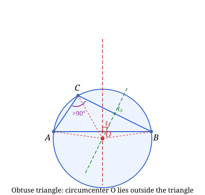

---

### Part 2: Inscribed Angle and Central Angle

**Definition**: Let $O$ be the center of a circle and $A$, $B$ points on the circle.
- The **central angle** $\angle AOB$ is the angle at $O$ subtended by the arc $AB$.
- An **inscribed angle** (also called a **circular angle**) $\angle APB$ is the angle at a point $P$ on the circle outside the same arc $AB$.

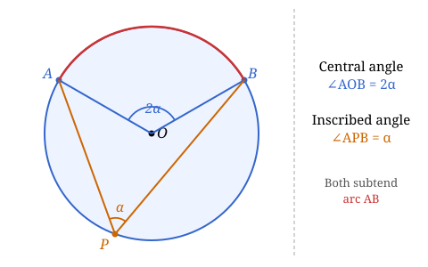

**Theorem 2 (Inscribed Angle Theorem)**: The inscribed angle is half the central angle of the same arc:
$$\angle APB = \frac{1}{2} \angle AOB.$$

**Proof**: The proof splits into three cases depending on whether the center $O$ lies inside, on a side of, or outside the angle $\angle APB$.

**Case 1 (O inside $\angle APB$)**: Draw the diameter $PD$ through $O$. Since $OA = OP = r$, triangle $OAP$ is isosceles, so
$$\angle OAP = \angle OPA = \beta_1.$$
The exterior angle of $\triangle OAP$ at $O$ gives $\angle AOD = 2\beta_1$.

Similarly, since $OB = OP = r$, triangle $OBP$ is isosceles, so
$$\angle OBP = \angle OPB = \beta_2,$$
and the exterior angle at $O$ gives $\angle BOD = 2\beta_2$.

Since $O$ is inside $\angle APB$:
$$\angle APB = \beta_1 + \beta_2 = \frac{1}{2}(2\beta_1 + 2\beta_2) = \frac{1}{2}(\angle AOD + \angle BOD) = \frac{1}{2}\angle AOB. \quad \blacksquare \text{ (Case 1)}$$

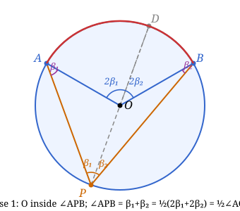

**Case 2 (O lies on PA)**: Here $PA$ is a diameter, so $OA = OP = r$ (both radii). Triangle $OPB$ is isosceles, giving
$$\angle OBP = \angle OPB = \beta.$$
The exterior angle at $O$ satisfies $\angle BOA = 2\beta$ (exterior angle of triangle $OPB$). Hence
$$\angle APB = \beta = \frac{1}{2}\angle AOB. \quad \blacksquare \text{ (Case 2)}$$

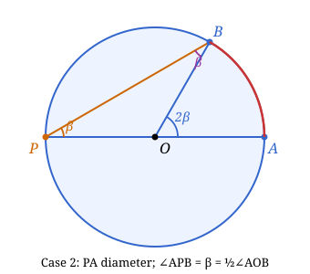

**Case 3 (O outside $\angle APB$)**: Draw the diameter $PD$ through $O$. Since $OA = OP = r$, triangle $OAP$ is isosceles, so
$$\angle OAP = \angle OPA = \beta_1,$$
and the exterior angle at $O$ gives $\angle AOD = 2\beta_1$.

Since $OB = OP = r$, triangle $OBP$ is isosceles, so
$$\angle OBP = \angle OPB = \beta_2,$$
and the exterior angle at $O$ gives $\angle BOD = 2\beta_2$.

Since $O$ is outside $\angle APB$, ray $PD$ falls outside the angle, so $\angle APB = \angle APD - \angle BPD$:
$$\angle APB = \beta_1 - \beta_2 = \frac{1}{2}(2\beta_1 - 2\beta_2) = \frac{1}{2}(\angle AOD - \angle BOD) = \frac{1}{2}\angle AOB. \quad \blacksquare \text{ (Case 3)}$$

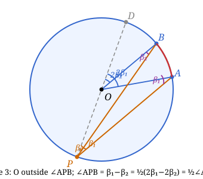

**Corollary 1 (Thales' Theorem)**: If $AB$ is a diameter of a circle, then the inscribed angle $\angle APB = 90°$ for any point $P$ on the circle (on the semicircle not containing $A$ or $B$).

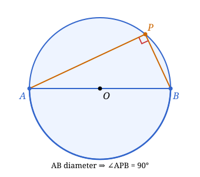

**Proof**: The central angle $\angle AOB = 180°$ (straight angle), so $\angle APB = \frac{1}{2} \cdot 180° = 90°$. $\blacksquare$

**Corollary 2**: All inscribed angles subtending the same arc are equal.

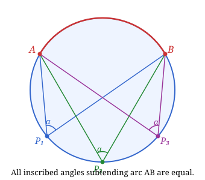

**Proof**: They are all equal to half the central angle subtending that arc. $\blacksquare$

**Corollary 3 (Cyclic Quadrilateral)**: If $APBQ$ is a quadrilateral inscribed in a circle, then opposite angles are supplementary:
$$\angle APB + \angle AQB = 180°.$$

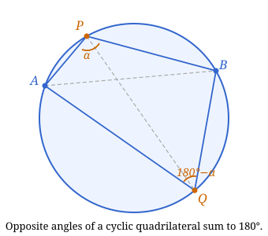

**Proof**: $P$ and $Q$ lie on opposite arcs. The central angles subtended by these arcs sum to $360°$, so the two inscribed angles sum to $\frac{1}{2} \cdot 360° = 180°$. $\blacksquare$

**Chord Butterfly Theorem**: If two chords $AB$ and $CD$ intersect at a point $O$, then $AO \cdot OB = CO \cdot OD$.

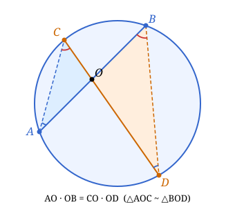

**Proof**: Triangles $AOC$ and $BOD$ are similar by **AA** ($\angle AOC = \angle BOD$ as vertical angles, $\angle OAC = \angle OBD$ as inscribed angles subtending the same arc). Hence
$$\frac{AO}{BO} = \frac{CO}{DO} \implies AO \cdot OD = BO \cdot CO. \quad \blacksquare$$