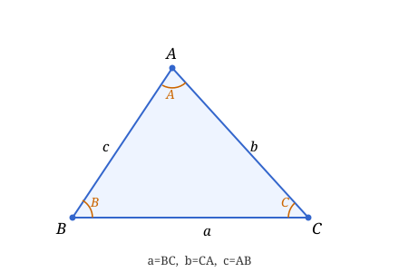
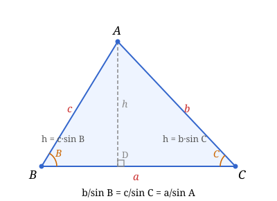
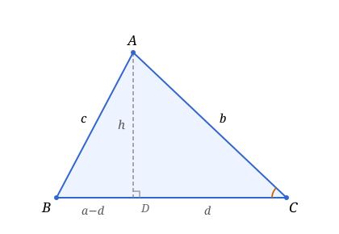

### Lecture 16: Triangle Laws

Throughout this lecture, $\triangle ABC$ has sides $a = BC$, $b = CA$, $c = AB$ opposite to angles $A$, $B$, $C$ respectively, circumradius $R$, inradius $r$, and semiperimeter $s = \dfrac{a+b+c}{2}$.

---

### Part 1: The Sine Law

**Theorem 1 (Sine Law)**: In any triangle $ABC$,
$$\frac{a}{\sin A} = \frac{b}{\sin B} = \frac{c}{\sin C}.$$

**Proof**: Draw the altitude from $A$ to $BC$ with foot $D$, and let $h = AD$. In right triangle $ABD$, $\sin B = h/c$; in right triangle $ACD$, $\sin C = h/b$. Hence $c\sin B = h = b\sin C$, giving $\dfrac{b}{\sin B} = \dfrac{c}{\sin C}$. By symmetry, repeating with altitudes from $B$ and $C$ yields all three ratios equal. $\blacksquare$

---

### Part 2: The Cosine Law

**Theorem 2 (Cosine Law)**: In any triangle $ABC$,
$$c^2 = a^2 + b^2 - 2ab\cos C.$$

Similarly, $a^2 = b^2 + c^2 - 2bc\cos A$ and $b^2 = a^2 + c^2 - 2ac\cos B$.

**Proof**: Draw the altitude from $A$ to $BC$ with foot $D$, and let $h = AD$. In right triangle $ACD$: $d = b\cos C$ and $h^2 = b^2 - d^2$. Since $BD = a - d$, the Pythagorean theorem on $\triangle ABD$ gives
$$c^2 = h^2 + (a-d)^2 = (b^2 - d^2) + (a^2 - 2ad + d^2) = a^2 + b^2 - 2ad.$$
Substituting $d = b\cos C$ yields $c^2 = a^2 + b^2 - 2ab\cos C$. $\blacksquare$

**Remark**: When $C = 90°$, $\cos C = 0$ and the cosine law reduces to the Pythagorean theorem $c^2 = a^2 + b^2$.

**Corollary**: $\cos C = \dfrac{a^2 + b^2 - c^2}{2ab}$, which determines $C$ uniquely given $a$, $b$, $c$.

---

### Part 3: Heron's Formula

**Theorem 3 (Heron's Formula)**: The area of a triangle with sides $a$, $b$, $c$ and semiperimeter $s = \frac{a+b+c}{2}$ is
$$S = \sqrt{s(s-a)(s-b)(s-c)}.$$

**Proof**: Use the same altitude $h$ from $A$ to foot $D$ on $BC$. From the cosine law proof, $d = CD = \dfrac{a^2+b^2-c^2}{2a}$ and $h = \sqrt{b^2 - d^2}$. The area is $S = \frac{1}{2}ah$, so:

$$\begin{align*}
S &= \frac{1}{2}a\sqrt{b^2-\left(\frac{a^2+b^2-c^2}{2a}\right)^2} \\
&= \frac{1}{2}\sqrt{a^2b^2-\left(\frac{a^2+b^2-c^2}{2}\right)^2} \\
&= \frac{1}{4}\sqrt{4a^2b^2-\left(a^2+b^2-c^2\right)^2} \\
&= \frac{1}{4}\sqrt{(2ab+a^2+b^2-c^2)(2ab-a^2-b^2+c^2)} \\
&= \frac{1}{4}\sqrt{((a+b)^2-c^2)(c^2-(a-b)^2)} \\
&= \frac{1}{4}\sqrt{(a+b+c)(a+b-c)(c+a-b)(c-a+b)} \\
&= \frac{1}{4}\sqrt{2s \cdot 2(s-c) \cdot 2(s-b) \cdot 2(s-a)} \\
&= \sqrt{s(s-a)(s-b)(s-c)}. \quad \blacksquare
\end{align*}$$
