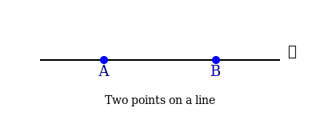
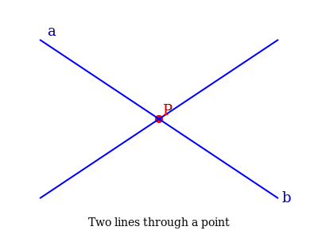
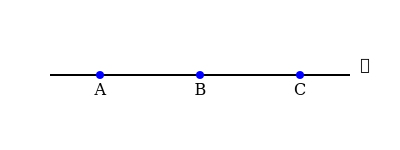
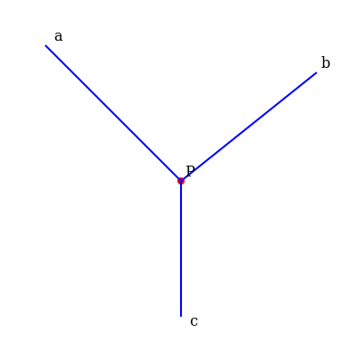
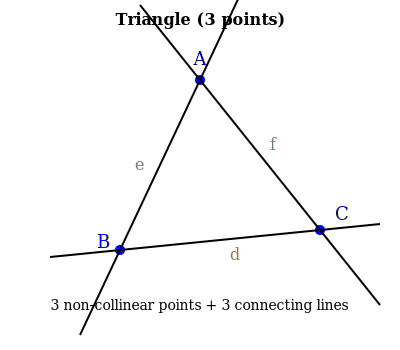
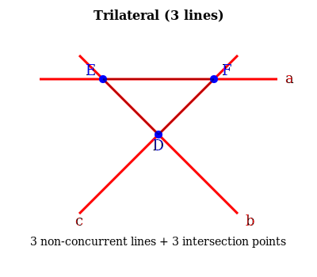
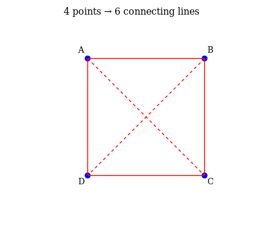

## Lecture 3: Duality Principles and Examples

### Review of Duality

From Lecture 2, we learned about the fundamental duality principle in projective geometry: statements about points and lines can be systematically interchanged to produce new valid theorems.

| Original Concept                          | Dual Concept                               |
|-------------------------------------------|---------------------------------------------|
| point                                     | line                                        |
| line                                      | point                                       |
| on  | through                                   |

### Duality in Action

#### Example 0: Two Points on a Line and Two Lines Through a Point

The simplest example of duality: consider two distinct points $A$ and $B$ lying on a line $\ell$.

By duality, we get: two distinct lines $a$ and $b$ passing through a point $P$.

This illustrates the fundamental duality:
- "Two points determine a line" ↔ "Two lines determine a point"

#### Example 1: From Three Collinear Points to Three Concurrent Lines

Consider three points $A$, $B$, $C$ lying on a line $\ell$.

By duality, we get: three lines $a$, $b$, $c$ passing through a point $P$.

#### Example 2: The Dual of a Triangle is a Triangle

A **triangle** consists of three non-collinear points $A$, $B$, $C$ and the three lines $d$, $e$, $f$ connecting them.

By duality, we interchange:
- The three **points** $A$, $B$, $C$ (uppercase) → three **lines** $a$, $b$, $c$ (lowercase, no three concurrent)
- The three **lines** $d$, $e$, $f$ (lowercase) → three **points** $D = b \cap c$, $E = b \cap a$, $F = c \cap b$ (uppercase)

The dual configuration is a **trilateral** (triangle formed by three lines).

Notice that both configurations represent triangles! This shows that the triangle is a **self-dual** figure in the sense that a triangle of points dualizes to a triangle of lines.

#### Example 3: Complete Quadrilateral and Complete Quadrangle

A **complete quadrilateral** consists of four lines (no three concurrent) and their six intersection points.

The dual configuration is a **complete quadrangle**: four points (no three collinear) and their six connecting lines.

### The Principle of Duality

**Principle of Duality:** Given any theorem in projective geometry involving points and lines, we can obtain a dual theorem by systematically interchanging:
- "point" ↔ "line"
- "lie on" ↔ "pass through"
- "collinear" ↔ "concurrent"
- "join" ↔ "intersect"

Both the original theorem and its dual are simultaneously true in the projective plane.

