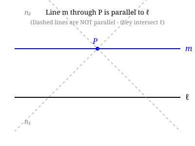
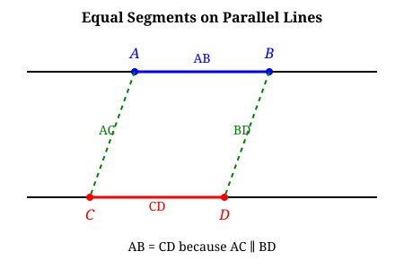
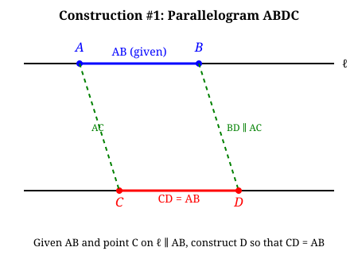
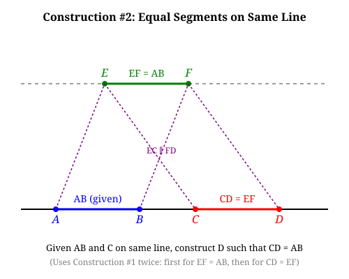
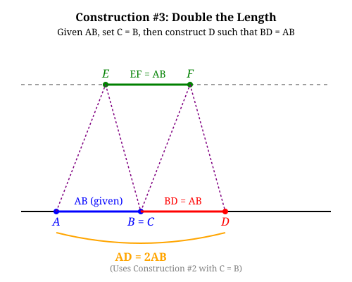
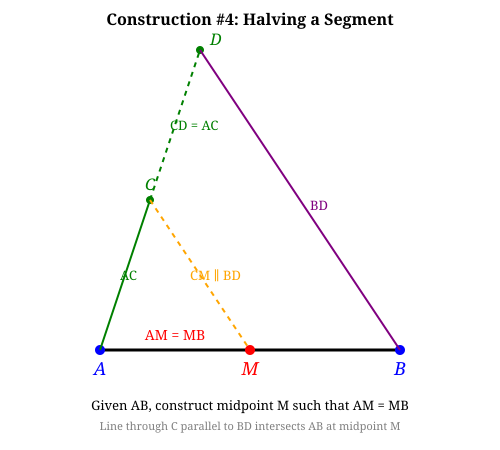
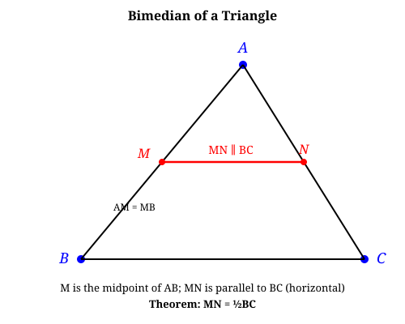
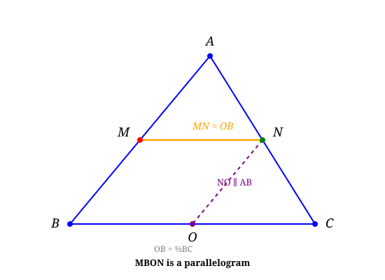

## Lecture 4: Parallel Lines and Parallogams

### Definition of Parallel Lines
Two lines are **parallel** if they do not intersect (i.e., they have no common point). 

### Euclid's fifth postulate (Parallel Postulate)
Given a line $\ell$ and a point $P$ not on $\ell$, there is exactly one line through $P$ that is parallel to $\ell$. 

The two dashed lines in the picture are nonparallel to $\ell$ because they intersect $\ell$. The solid line is the unique line through $P$ that is parallel to $\ell$.

Parallel lines can be constructed using skidding rulers. 

### Basic Properties of Parallel Lines
We use $a\parallel b$ to denote two lines $a$ and $b$ are parallel.
1. If $a\parallel b$ and $b\parallel c$, then $a\parallel c$. (Transitivity)
2. If $a\parallel b$ then $b\parallel a$. (Symmetry)
3. $a\parallel a$. (Reflexivity)

The transitivity property requires a proof, while the other two properties are obvious. If $a\parallel b$ and $b\parallel c$, but $a$ is not parallel to $c$, then $a$ and $c$ intersect at some point $P$. By Euclid's fifth, there is exactly one line through $P$ parallel to $b$. But both $a$ and $c$ are parallel to $b$ and pass through $P$, which is a contradiction.

### Equality of segments on parallel lines
**Definition**: Two segments $AB$ and $CD$ are **equal** on two parallel lines if $AC$ and $BD$ (or $AD$ and $BC$) are parallel.

**Definition**: A **parallogram** is a quadrilateral $ABCD$ such that $AB\parallel CD$ and $AD\parallel BC$.

**Key property**: two opposite sides of a parallelogram are equal, i.e., $AB=CD$ and $AD=BC$.

**Construction #1**: Given a segment $AB$, a point $C$ on a line $\ell$ parallel to $AB$, we can first construct the line $AC$, then construct the line through $B$ parallel to $AC$ to find point $D$ such that $ABCD$ is a parallelogram and $AB=CD$.

**Construction #2**: Given a segment $AB$ and a point $C$ on the same line, construct a line segment $CD$ such that $AD=BC$.

By construction #1, we can first construct a parallel line to $AB$ and a line segment $EF$ equal to $AB$. Then by construction #1 again, we can construct $CD=EF$. 

**Construction #3**: Given a segment $AB$, construct a line segment on the same line doubling the length.

This is easy by putting $C=B$. 

### Construction #4: Halving a segment
Given a segment $AB$, construct its midpoint $M$ such that $AM=MB$. 

Steps:
1. Construct another line though $A$
2. Pick a point $C$ on this line and construct $AC$.
3. By Construction #3, construct a point $D$ such that $AC=CD$.
4. Construct the line $BD$.
5. Construct the line through $C$ parallel to $BD$ and let it intersect $AB$ at $M$.

**Key Lemma**: Equal segments on a line projects to equal segments on another line via parallel lines.

We will prove this in next lecture.

### Bimedian of a Triangle
Given a triangle $ABC$, the **bimedian** is the segment determined by the parallel line through the midpoint of one edge.

**Theorem**: The bimedian of the triangle $ABC$ is half the length of the opposite edge, i.e., $MN=\frac{1}{2}BC$.

Steps of the proof:
1. Construct the midpoint of $AB$ by Construction #4 and denote it by $M$.
2. Construct the line through $M$ parallel to $BC$ and let it intersect $AC$ at $N$.
3. By the key lemma, $AM=MB$ implies $AN=NC$. Thus, $N$ is the midpoint of $BC$.
4. Construct the bimedian $NO$ through $N$ parallel to $AB$ and let it intersect $AC$ at $O$.
5. By the key lemma again, $AM=MB$ implies $NO=OC$. Thus, $O$ is the midpoint of $AC$.
6. Finally, since $MNOB$ is a parallelogram, we have $MN=OB$. But $OB=\frac{1}{2}BC$ since $O$ is the midpoint of $BC$. Therefore, $MN=\frac{1}{2}BC$.

