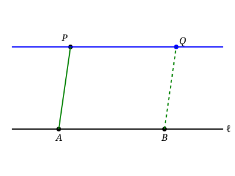
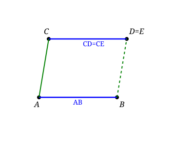
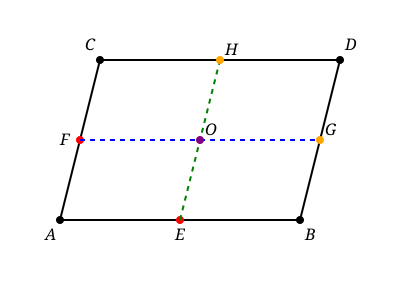
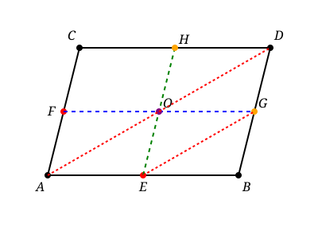
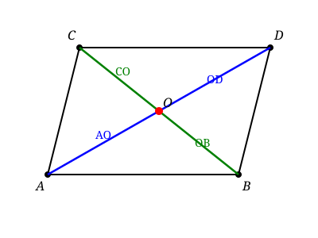
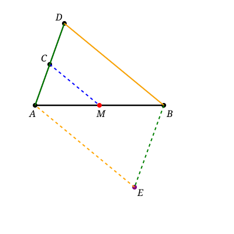
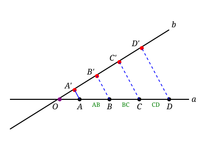
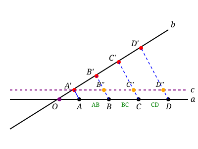

## Lecture 5: More on Parallelograms
### Recap of previous lecture
**New construction**: Given a point $P$ and a line $\ell$, we can construct the line through $P$ parallel to $\ell$.

By marking points on the lines, we can easily construct a parallelogram. For example, if we have points $A$ and $B$ on line $\ell$, we can construct a parallelogram by a line parallel to $AP$ through $B$. So we get a parallelogram $ABQP$. 

**Definition:** Opposite edges of a parallelogram are parallel and equal in length.

**Double a segment:**

### Construction #4: Halving a segment
Given a segment $AB$, construct its midpoint $M$ such that $AM=MB$. 

Steps:
1. Construct another line though $A$
2. Pick a point $C$ on this line and construct $AC$.
3. By Construction #3, construct a point $D$ such that $AC=CD$.
4. Construct the line $BD$.
5. Construct the line through $C$ parallel to $BD$ and let it intersect $AB$ at $M$.

This construcion requires the following key lemma and we will prove it in this lecture.
**Key Lemma** Equal segments on a line projects to equal segments on another line via parallel lines.

**Lemma 1:** Given two parallel segments $AB$ and $CD$ such that $AB=CD$, then $ABCD$ is a parallelogram.

**Proof:** 
1. Construct the line $AC$
2. Construct the line through $B$ parallel to $AC$ and let it intersect the line $AB$ at $E$. So we know $ABCE$ is a parallelogram and $AB=CE$.
3. Now we have $AB=CD=CE$. So $D=E$. Thus, $ABCD$ is a parallelogram.

Thus we have the following **two equivalent definitions of a parallelogram**:
1. two set of parallel lines
2. one pair of parallel lines with equal segments

**Lemma 2:** Given a parallelogram $ABCD$ and mid points $E$ on $AB$ and $F$ on $AC$, then the line parallel to $AB$ through $F$ and the line parallel to $AC$ through $E$ cut the parallelogram into four equal parallelograms. All horizontal segments are equal and all vertical segments are equal.

**Definition:** $O$ is called the **center** of the parallelogram $ABCD$ if $O$ is the intersection of $FG$ and $EH$.

**Proof:** It is trivial because all small parallelograms are determined by two pairs of parallel lines.

**Lemma 3:** $AEGO$ and $EGDO$ are parallelograms.

**Proof:** By Lemma 2, we know that $OG=AE$. Since $OG\parallel AE$, by Lemma 1 we know that $AEGO$ is a parallelogram. 

Similarly, by Lemma 2 again, we know that $DG=OE$. Since $DG\parallel OE$, by Lemma 1 we know that $EGDO$ is a parallelogram.

**Lemma 4:** $AO$ and $OD$ are on the same line as the diagonal $AD$ and $AO=OD$.

**Proof:** By Lemma 3, we know that $AO\parallel EG$ and $AO=EG$, also $OD\parallel EG$ and $OD=EG$. Thus, $AO=OD$ and they are parallel to $EG$. By Euclid's fifth postulate, $AO$ and $OD$ are on the same line as $AD$.

In particular, we prove the following theorem about the center of a parallelogram.
**Theorem 1:** The center of the parallelogram is on the diagonal and bisects the diagonal, i.e., $AO=OD$ and $CO=OB$.

### Proof of the key lemma for Construction #4
Now we are ready to prove the key lemma for Construction #4.

Steps:
1. Start with the line segment $AB$ and $AC$. 
2. By Construction #3, construct a point $D$ such that $AC=CD$.
4. Construct the line $BD$.
5. Construct the line through $C$ parallel to $BD$ and let it intersect $AB$ at $M$.
6. Construct the parallogram $ADBE$ with $EB\parallel AD$ and $AE\parallel DB$. 

**Proof:** We know that $AB$ is the diagonal of the parallelogram $ADBE$. We also know that $O$ sits on $CM$ and $O$ sits on $AB$. So $O=M$. By Theorem 1, the center of the parallelogram is on the diagonal $AB$ and bisects it. Thus, $AM=MB$.

### Generalized version of the key lemma

**Equal segments project to equal segments between lines**

Steps:
1. Construct two lines $a$, $b$ through $O$. 
2. Construct $A,B,C,D$ on $a$ such that $AB=BC=CD$.
3. Choose any point $A'$ on $b$.
4. Construct $B'$ such that $BB'$ is parallel to $AA'$.
5. Construct $C'$ such that $CC'$ is parallel to $AA'$.
6. Construct $D'$ such that $DD'$ is parallel to $AA'$.
7. **Then we have $A'B'=B'C'=C'D'$.**

How to prove it?

Construct another line $c$ parallel to $a$ through $A'$. $c$ intersects $BB'$ at $B''$, $CC'$ at $C''$ and $DD'$ at $D''$. 

By paralleogram property, we know that $AB=BC=CD$ implies $A'B''=B''C''=C''D''$. Now the key lemma implies that $A'B'=B'C'$ since $A'B''=B''C''$. Similarly, $B'C'=C'D'$. Thus, $A'B'=B'C'=C'D'$.