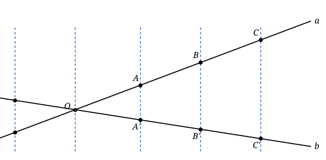
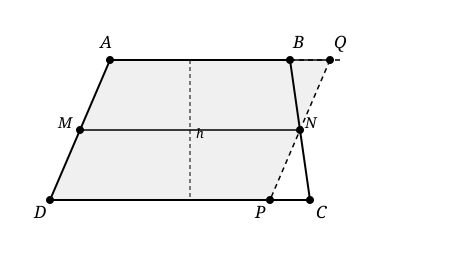

## Lecture 6: Trapezoids and Medians
### Parallel projection 

Consider two lines $a$ and $b$ intersecting at point $O$. Any family of parallel lines can be used to project points from line $a$ to line $b$. We call this process a **parallel projection**.

Here is the restated important lemma about parallel projection, where we proved in last lecture using properties of parallelograms.

**Key Lemma:** Equal segments gives equal segments under parallel projection.

### Trapezoids
A **trapezoid** is a quadrilateral with at least one pair of parallel sides.

The **median** of a trapezoid is the line segment that passes through the mid point of $AD$ and parallel to $AB$ or $CD$.

By the key lemma of parallel projection, the median intersects $BC$ at its mid point. So the median is equivalently defined as the line segment that connects the mid points of $AD$ and $BC$.

**Theorem** the length of the median is equal to the average of the lengths of the two parallel sides, i.e., median $= \frac{AB+CD}{2}$.

**Proof:**
1. We connect $A$ and $C$ and it intersects $MN$ at $P$.
2. By the key lemma of parallel projection, we know that $AP=PC$. In particular, $MP$ is the bimedian of triangle $ADC$ and $PN$ is the bimedian of triangle $ACB$.
3. By the bimedian theorem, we know that $MP=\frac{AD}{2}$ and $PN=\frac{BC}{2}$.
4. So $$MN=MP+PN=\frac{AD}{2}+\frac{BC}{2}=\frac{AD+BC}{2}$$

The above formula actually related to the area of the trapezoid as well. We can construct a line through $N$ parallel to $AD$ and let it intersect the extension of $AB$ at $Q$ and $DC$ at $P$. Then $ADPQ$ is a parallelogram and its area is the same as the area of trapezoid $ABCD$. So the area of trapezoid $ABCD$ is given by $$\text{Area}=\text{median}\times \text{height}=\frac{AB+CD}{2}\times \text{height}.$$

### Medians of a triangle
A **median** of a triangle is the line segment that connects a vertex to the mid point of the opposite side.

**Theorem:** The two medians $BN$ and $CL$ intersect at point $O$ and $BO:ON=LO:OC=2:1$.

**Proof:**
1. Construct the bimedian $LN$ of triangle $ABC$. So we have $LN=\frac{1}{2}BC$ and $LN\parallel BC$.
2. Construct the bimedian $PQ$ of the triangle $BCO$ which is parallel to $BC$. We know that $PQ=\frac{1}{2}BC$ and $PQ\parallel BC$.
3. By transitivity, we have $LN=PQ$ and $LN\parallel PQ$. That tells us $LNPQ$ is a parallelogram.
4. Since $NP$ and $LQ$ are the diangonals of the parallelogram $LNPQ$, they bisect each other. So $O$ is the mid point of both $NP$ and $LQ$.
5. Thus we have $NO=OP=PB$ and $LO=OQ=QC$. The theorem is proved. 

Theorem clearly works for any two medians of the triangle. So $AM$ and $CL$ also intersect at point $O$ and $AO:OM=LO:OC=2:1$. This tells us that all three medians of the triangle intersect at the same point $O$, which is called the **centroid** of the triangle.

**Corollary:** The three medians of a triangle intersect at the centroid which is two thirds the distance from each vertex to the mid point of the opposite side.

