## Lecture 7: Vectors

### One dimensional vectors
A vector is a directed segment. It has both magnitude and direction. One dimensional vectors sit on a number line. The direction is pointing to either left or right. Examples are as below for two vectors on the line:

The starting point of the vector is called the **tail**, and the ending point is called the **head**. The length of the vector is called its **magnitude**. The direction is indicated by the position of the head relative to the tail. If the head is to the right of the tail, the vector points to the right; if the head is to the left of the tail, the vector points to the left.

### Standard representation
If the beginning point sits at zero, then the vector can be represented simply by its endpoint value. For example, the vector that starts at 0 and ends at 3 can be represented as $\overrightarrow{3}$, and the vector that starts at 0 and ends at -2 can be represented as $\overrightarrow{-2}$. The direction is indicated by the sign of the number.

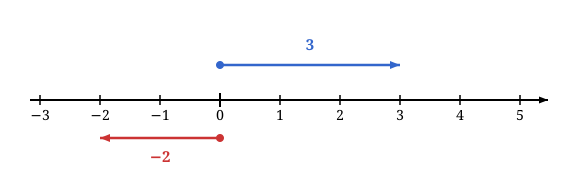

### Addition and subtraction of one dimensional vectors

Vectors can be **added** together by placing them head to tail. For example, adding the vectors $\overrightarrow{3}$ and $\overrightarrow{2}$ results in a vector that starts at 0 and ends at 5:

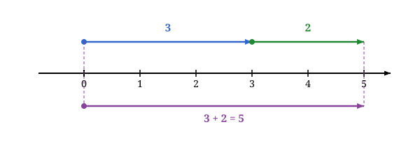

In previous lectures, we know we can move a segment to any point on the number line without changing its length by constructing parallel lines and parallelograms. So we can move the vector $\overrightarrow{2}$ to start at the head of the vector $\overrightarrow{3}$ without changing its length. This means that adding two vectors is equivalent to adding their magnitudes.

So if we have two numbers $a$ and $b$ representing two vectors $\overrightarrow{a}$ and $\overrightarrow{b}$, then their sum is given by:

$$\overrightarrow{a} + \overrightarrow{b} = \overrightarrow{a+b}$$

How about subtraction? Subtraction can be thought of as adding a negative vector. For example, subtracting the vector $\vec{2}$ from the vector $\vec{3}$ can be visualized as adding the vector $\overrightarrow{-2}$ to the vector $\overrightarrow{3}$:

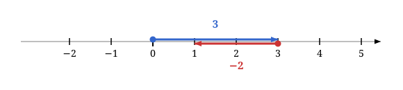

So if we have two numbers $a$ and $b$ representing two vectors $\overrightarrow{a}$ and $\overrightarrow{b}$, then their difference is given by: 
$$\overrightarrow{a} - \overrightarrow{b} = \overrightarrow{a} + \overrightarrow{-b} = \overrightarrow{a-b}$$

### Two dimensional vectors
Two dimensional vectors can be represented as directed segments in the plane. See following two vectors in the plane:

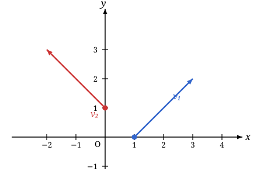

If the head of the vector sits at the origin $(0,0)$, a two dimensional vector can be represented by an ordered pair of numbers $(x, y)$, where $x$ is the horizontal component and $y$ is the vertical component. For example, the vector that starts at the origin $(0, 0)$ and ends at the point $(2, 1)$ can be represented as $\overrightarrow{(2, 1)}$.

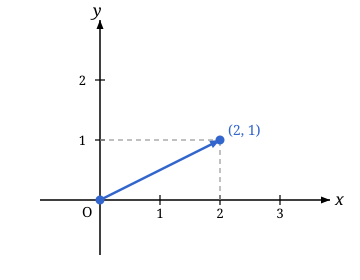

### Addition of two dimensional vectors
How about the addition of two dimensional vectors? Let us consider a special case first. We want to consider the addition

$$\overrightarrow{(2,0)}+\overrightarrow{(0,1)}$$

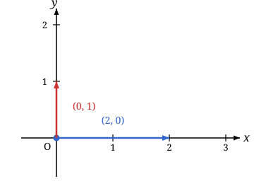

First geometric interpretation, the vector $\overrightarrow{(2,0)}$ means moving 2 units to the right, and the vector $\overrightarrow{(0,1)}$ means moving 1 unit up. So adding these two vectors results in a vector that starts at the origin and ends at the point $(2, 1)$. This is the **head-to-tail** method of vector addition generalizing the dimension one case.

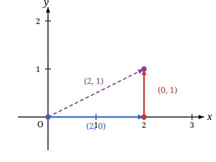

Or equivalently, we can construct a parallelogram with the two vectors as adjacent sides. The resulting diagonal vector starting at the origin and ending at the point $(2, 1)$ is the sum of the two vectors.

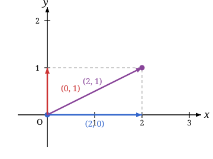

In this special case, we can see that adding the two vectors results in a vector whose components are the sums of the corresponding components of the two vectors:

$$\overrightarrow{(2,0)} + \overrightarrow{(0,1)} = \overrightarrow{(2+0,0+1)} = \overrightarrow{(2,1)}$$

In general, we have the following **canonical decomposition** of any two dimensional vector:

$$\overrightarrow{(x,y)} = \overrightarrow{(x,0)} + \overrightarrow{(0,y)}$$

We can view any vector $\overrightarrow{(x,y)}$ as moving $x$ units in the horizontal direction and $y$ units in the vertical direction. 

Now for the general case of adding two vectors 

$$\overrightarrow{(2,1)}+\overrightarrow{(1,1)}$$ 

we can use the head-to-tail method or the parallelogram method to visualize the addition:

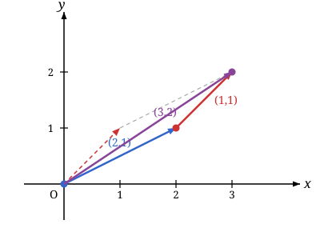

Actually, we can decompose both vectors into their horizontal and vertical components:

$$\overrightarrow{(2,1)}+\overrightarrow{(1,1)} = \left(\overrightarrow{(2,0)} + \overrightarrow{(0,1)}\right) + \left(\overrightarrow{(1,0)} + \overrightarrow{(0,1)}\right)=\overrightarrow{(3,0)}+\overrightarrow{(0,2)}=\overrightarrow{(3,2)}$$

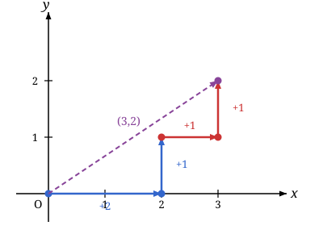

### Subtraction of two dimensional vectors
First we define the negative of a vector. The negative of a vector $\overrightarrow{(x,y)}$ is the vector $\overrightarrow{(-x,-y)}$. Geometrically, this is the vector that has the same magnitude as $\overrightarrow{(x,y)}$ but points in the opposite direction.

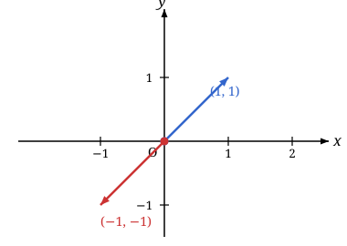

Now we can define subtraction of two vectors as adding the negative of the second vector. For example, to subtract the vector $\overrightarrow{(1,1)}$ from the vector $\overrightarrow{(2,1)}$, we can add the negative of $\overrightarrow{(1,1)}$:

$$\overrightarrow{(2,1)} - \overrightarrow{(1,1)} = \overrightarrow{(2,1)} + \overrightarrow{(-1,-1)}= \overrightarrow{(1,0)}$$

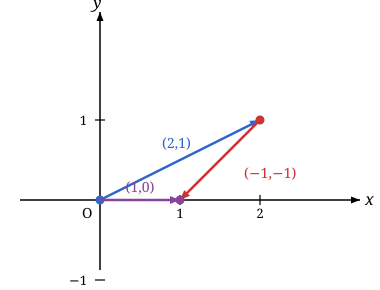

The general formula for subtracting two vectors is:
$$\overrightarrow{(x_1,y_1)} - \overrightarrow{(x_2,y_2)} = 
\overrightarrow{(x_1,y_1)} + \overrightarrow{(-x_2,-y_2)} =
\overrightarrow{(x_1 - x_2, y_1 - y_2)}$$
