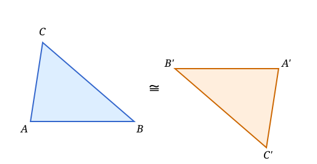
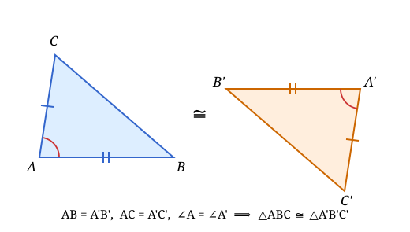
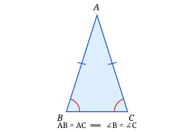
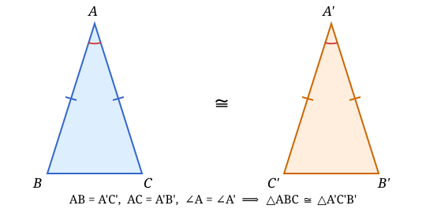
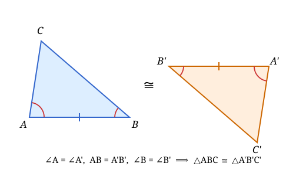
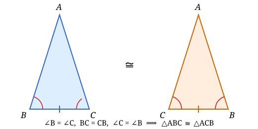
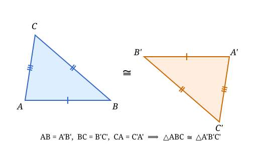
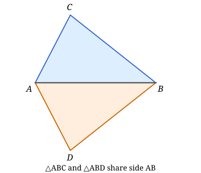
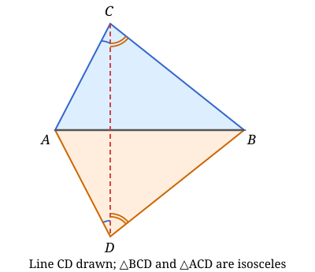

## Lecture 8: Congruence of Triangles
### The Concept of Congruence
* Two line segments are **congruent** if they have the same length.
* Two angles are **congruent** if they have the same measure in degrees.
* Two shapes are **congruent** if they can be made to coincide exactly by moving one on top of the other one. 
* In particular, two **congruent** triangles have their corresponding sides and angles are the same. Thus if triangle $\Delta ABC$ is congruent to triangle $\Delta A'B'C'$, then we have $AB = A'B'$, $BC = B'C'$, $CA = C'A'$, $\angle A = \angle A'$, $\angle B = \angle B'$, and $\angle C = \angle C'$. Six corresponding parts are equal.

### Congruence Theorems of Triangles
Congruence theorems provide criteria to determine when two triangles are congruent based on fewer than six pairs of corresponding parts. 

**Congruence Theorem I (SAS)** If two triangles have two pairs of sides equal in length, and the included angles between those sides are equal in measure, then the triangles are congruent.

An **isosceles triangle** is a triangle with at least two sides equal in length. The two angles opposite to the equal sides are called the **base angles**.

**Isosceles Triangle Theorem I** : The base angles of an isosceles triangle are equal.

**Proof**: Consider the first triangle $\Delta ABC$ and the second triangle $\Delta A'B'C'$ as the mirror image. In particular, they are congruent and we have $AB = A'B'$, $AC = A'C'$, $\angle B = \angle B'$ and $\angle C=\angle C'$.  

Now since $\Delta A'B'C'$ is an isosceles triangle, we have $AB = A'B' = A'C'$ and $AC = A'C' = A'B'$. Together with $\angle A = \angle D$, by the SAS Congruence Theorem, we prove $\Delta ABC$ is congruent to $\Delta A'C'B'$. This tells $\Delta A'C'B'$ is also a translation of $\Delta ABC$. Therefore $\angle B=\angle C'=\angle C$.

**Congruence Theorem II (ASA)** If two triangles have two pairs of angles equal, and the included sides between those angles are equal in length, then the triangles are congruent.

**Isosceles Triangle Theorem II** : If two angles of a triangle are equal, then it is an isosceles triangle.

**proof**: Consider the first triangle $\Delta ABC$ and the second triangle $\Delta ACB$. We have $\angle B = \angle C$ (given), $\angle C = \angle B$ (given), and $AC = AB$ (common side). By the ASA Congruence Theorem, the two triangles are congruent, hence the corresponding sides $AB$ and $AC$ are equal.

**Congruence Theorem III (SSS)** If two triangles have all three pairs of sides equal in length, then the triangles are congruent.

**Proof**: First we align the two congruent triangles so that one pair of equal sides coincide and make sure they are on the opposite side. We have $\Delta ABC$ and $\Delta ABD$. 

Next we draw the line $CD$. Since $BC = BD$, the triangle $\Delta BCD$ is isosceles, hence the angles $\angle BCD$ and $\angle BDC$ are equal. Similarly, since $AC = AD$, the triangle $\Delta ACD$ is isosceles, hence the angles $\angle CAD$ and $\angle CDA$ are equal. This implies that the angles $\angle ACB$ and $\angle ADB$ are equal.

Since $AC=AD$ and $BC=BD$, the two triangles $\Delta ABC$ and $\Delta ABD$ are congruent by SAS Congruence Theorem.

**Exercise:** What if the angle $\angle CAB$ is obtuse? You may prove using the same argument with minor modifications.

### How to Prove the Congruence Theorems 
**Proof of SAS Congurence Theorem**: The idea of the proof is to use the process of superposition. We can move one triangle on top of the other one by first aligning one pair of equal sides, then rotating around that side to align the included angles, and finally sliding along the aligned side to align the second pair of equal sides. After these movements, the two triangles coincide exactly, hence they are congruent.

**Proof of ASA Congurence Theorem**: The idea of the proof is to use the process of superposition. We can move one triangle on top of the other one by first aligning one pair of equal angles, then rotating around that angle to align the included sides, and finally sliding along the aligned side to align the second pair of equal angles. After these movements, the two triangles coincide exactly, hence they are congruent.

### Homework Problems
1. In a given triangle, an altitude is a bisector. Prove that the triangle is isosceles.
2. In a given triangle, an altitude is a median. Prove that the triangle is isosceles.
3. On each side of an equilateral triangle $ABC$, congruent segments $AB'$, $BC'$, and $AC'$ are marked, and the points $A'$, $B'$, and $C'$ are connected by lines. Prove that the triangle $A'B'C'$ is also equilateral.
4. Suppose that an angle, its bisector, and one side of this angle in one triangle are respectively congruent to an angle, its bisector, and one side of this angle in another triangle. Prove that such triangles are congruent.
5. Prove that if two sides and the median drawn to the first of them in one triangle are respectively congruent to two sides and the median drawn to the first of them in another triangle, then such triangles are congruent.
6. Give an example of two non-congruent triangles such that two sides and one angle of one triangle are respectively congruent to two sides and one angle of the other triangle.
7. On one side of an angle $A$, the segments $AB$ and $AC$ are marked, and on the other side the segments $AB' = AB$ and $AC" = AC$. Prove that the lines $BC'$ and $B'C$ meet on the bisector of the angle $A$.
8. Prove that in a convex pentagon: (a) if all sides are congruent, and all diagonals are congruent, then all interior angles are congruent, and (b) if all sides are congruent, and all interior angles are congruent, then all diagonals are congruent.
9. Is this true that in a convex polygon, if all diagonals are congruent, and all interior angels are congruent, then all sides are congruent? Justify your answer.