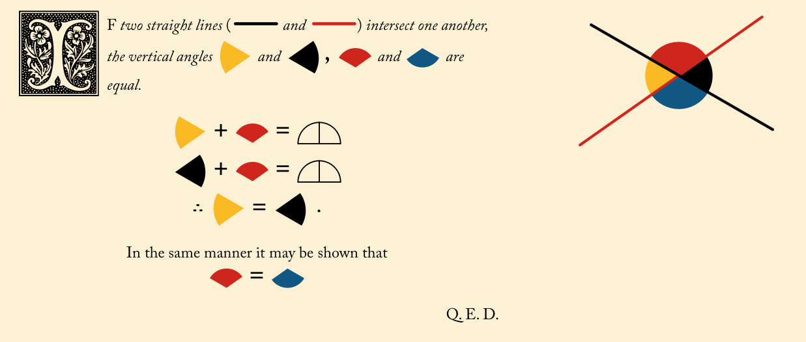
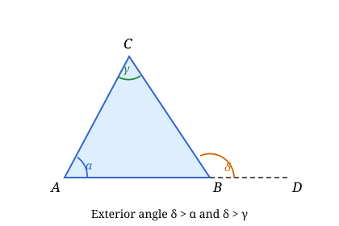
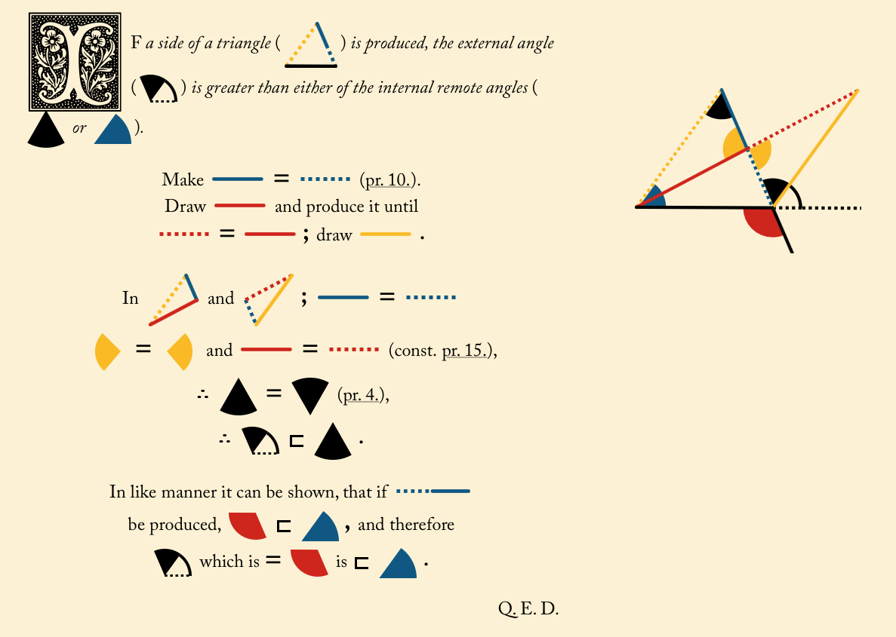
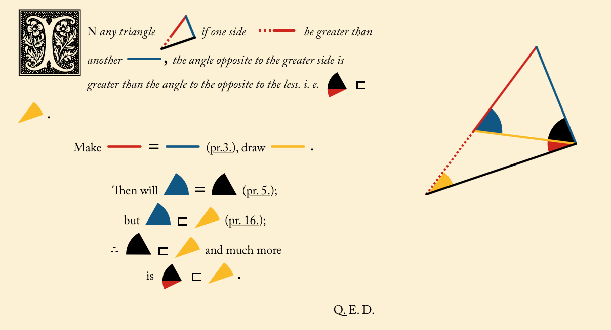
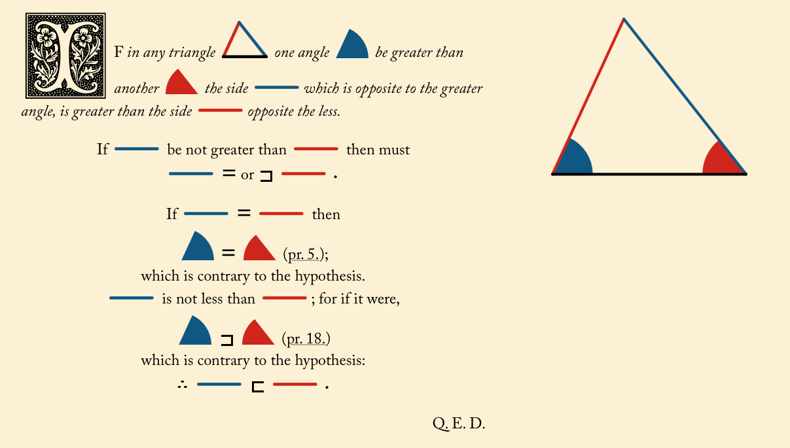
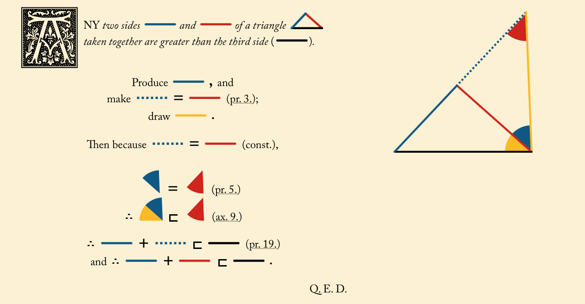
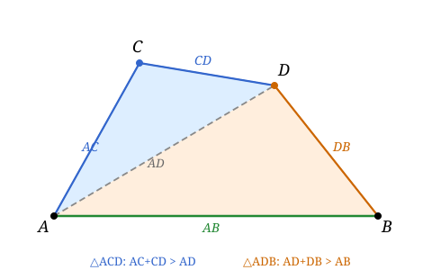
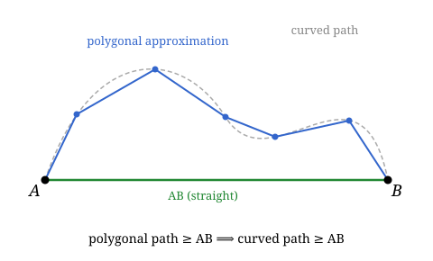

## Lecture 9: Triangle inequality
The main goal of this lecture is to prove the **shortest path** between two points is a straight line. This is quite intuitive, but Euclid spent a lot of time proving it rigorously. We will follow Euclid's approach and prove some basic properties of angles and triangles along the way.

Two angles are called **vertical angles** if their sides form two pairs of opposite rays. 

**[Euclid I Proposition 15](https://www.c82.net/euclid/en/book1/#prop15)**: Vertical angles are congruent.

**Proof**: The best proof is [Euclid I Proposition 15](https://www.c82.net/euclid/en/book1/#prop15) or see Kiselev #26.

The **exterior angle** of a triangle is the angle formed by one side of the triangle and the extension of an adjacent side.

**[Euclid I Proposition 16](https://www.c82.net/euclid/en/book1/#prop16)**: The exterior angle of a triangle is greater than either of the interior opposite angles.

**Proof**: The best proof is [Euclid I Proposition 16](https://www.c82.net/euclid/en/book1/#prop16) or see Kiselev #42.

**Corollary**: if one angle of a triangle is a right angle or an obtuse angle, then the other two angles are acute angles.

**Proof:** If one angle of a triangle is a right angle or an obtuse angle, then the exterior angle of the triangle is less than or equal to 90 degrees. Therefore, the other two angles must be acute angles by [Euclid I Proposition 16](https://www.c82.net/euclid/en/book1/#prop16).

**[Euclid I Proposition 18](https://www.c82.net/euclid/en/book1/#prop18)**: The angle opposite the longer side of a triangle is greater than the angle opposite the shorter side.

**[Euclid I Proposition 19](https://www.c82.net/euclid/en/book1/#prop19)**: The side opposite the greater angle of a triangle is longer than the side opposite the lesser angle.

**[Euclid I Proposition 20](https://www.c82.net/euclid/en/book1/#prop20)**: The sum of any two sides of a triangle is greater than the third side.

Euclid I Proposition 20 is also known as the **triangle inequality**. It actually implies the shortest path between two points is a straight line. To see this, let $A$ and $B$ be two points and let $C$ be any point on the plane. Then by the triangle inequality, we have

$$AC + CB > AB.$$

This generalizes to any number of points. For example, if we have points $A$, $B$, $C$, and $D$, then we have   

$$AC + CD + DB > AB.$$

To prove this, we can apply the triangle inequality twice. First, we apply it to the triangle formed by points $A$, $C$, and $D$ to get $AC + CD > AD$. Then, we apply it to the triangle formed by points $A$, $D$, and $B$ to get $$AD + DB > AB.$$ Adding these two inequalities together gives us $$AC + CD + DB > AB.$$

**Theorem**: The shortest path between two points is a straight line.
**Proof**: We proved the case for three points above. It generalizes to any number of points by applying the triangle inequality repeatedly. Now what if you have a curved path between two points? We can approximate the curved path by a polygonal path, which is a path made up of straight line segments. By applying the triangle inequality to each segment of the polygonal path, we can show that the total length of the polygonal path is greater than the length of the straight line segment connecting the two points. Therefore, the shortest path between two points is a straight line.

